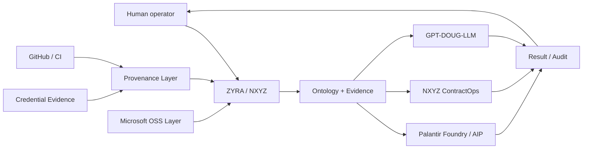

<p align="center">
  <a href="ZYRA.README.md">
    
  </a>
</p>

<h1 align="center">ZYRA // NXYZ</h1>

<p align="center">
  
</p>

<p align="center">
  <a href="https://github.com/sonoxo/zyra">
    
  </a>
</p>

<p align="center"><strong>Governed agentic software, evidence-backed credentials, ontology-driven operations, and human-controlled execution.</strong></p>

<p align="center">
  
  
  
</p>

<p align="center">
  
  
  
  
</p>

### Live build telemetry

<p align="center">
  <a href="https://github.com/sonoxo/zyra/actions/workflows/ci.yml"></a>
  <a href="https://github.com/sonoxo/zyra/actions/workflows/codeql.yml"></a>
  <a href="https://github.com/sonoxo/zyra/actions/workflows/baseline-assurance-ci.yml"></a>
  <a href="https://github.com/sonoxo/zyra/actions/workflows/tsc-ci.yml"></a>
  <a href="https://github.com/sonoxo/zyra/actions/workflows/zyra-live-implement.yml"></a>
</p>

<p align="center">
  <a href="#-about-me"><strong>ABOUT</strong></a> ·
  <a href="#-tech--security-stack"><strong>STACK</strong></a> ·
  <a href="#ecosystem-architecture"><strong>ARCHITECTURE</strong></a> ·
  <a href="#products-in-the-ecosystem"><strong>PRODUCTS</strong></a> ·
  <a href="#ussf--space-systems-command-prospective-collaboration"><strong>USSF / SSC</strong></a> ·
  <a href="#run-zyra"><strong>RUN ZYRA</strong></a> ·
  <a href="#security--trust"><strong>SECURITY</strong></a>
</p>

---

## 🛡️ About Me

<table>
<tr>
<td width="50%" valign="top">

### Operator Focus

- 🔭 I’m currently working on **penetration testing & threat intelligence**.
- 🌱 I’m currently learning **advanced malware analysis and reverse engineering**.
- ⚡ Fun fact: **I break things to make them stronger.**

</td>
<td width="50%" valign="top">

### ZYRA Mission

```text
MISSION → POLICY → ONTOLOGY → ACTION → EVIDENCE
```

ZYRA is built around **authorized defensive security**, **governed automation**, **evidence preservation**, and **human-controlled execution**.

</td>
</tr>
</table>

---

## 🧰 Tech & Security Stack

| Layer | Stack |
|---|---|
| **Languages** | Python · Bash · C++ · Go · PowerShell |
| **Security Tools** | Wireshark · Burp Suite · Metasploit · Nmap · Ghidra · Splunk |
| **Platforms** | Linux · Windows Server · Docker · AWS Security |
| **ZYRA Core** | React · TypeScript · Express · PostgreSQL |
| **Governance** | Policy gates · Ontology contracts · Evidence models · Human authorization |

---

## 📊 GitHub Stats

<p align="center">
  
  
</p>

---

## External credential & ecosystem provenance

<p align="center">
  <a href="ZYRA.README.md"></a>
  <a href="ZYRA.README.md"></a>
  <a href="ZYRA.README.md"></a>
  <a href="ZYRA.README.md"></a>
</p>
<p align="center">
  <a href="ZYRA.README.md"></a>
  <a href="docs/NXYZ-MICROSOFT-OSS-LAYER.md"></a>
  <a href="https://github.com/sonoxo/zyra/actions"></a>
</p>
<p align="center">
  <a href="ZYRA.README.md"></a>
  <a href="ZYRA.README.md"></a>
</p>

> **Compliance boundary:** the logos above identify documented credential issuers, verification services, software ecosystems, or repository infrastructure. Their presence does **not** mean those companies sponsor, partner with, certify, approve, employ, authorize, or endorse ZYRA/NXYZ. External platform permissions remain controlled by the external platform.

| Organization | Relationship to ZYRA | Evidence/status |
|---|---|---|
| **Palantir** | Credential issuer + Foundry/AIP integration ecosystem + separately tracked platform access | Issuer-verifiable Palantir Learn/Skilljar records are documented in [`ZYRA.README.md`](ZYRA.README.md); Foundry/AIP code and ontology contracts are checked in. |
| **Google** | External credential issuer | Google Cybersecurity, Google AI, and Business Intelligence evidence is documented in the credential ledger. |
| **IBM** | External credential/training issuer | IBM Quantum Machine Learning / Credly and IBM SkillsBuild evidence are documented in the credential ledger. |
| **Red Hat** | External training issuer | System Administration I training evidence is retained at its recorded evidence tier. |
| **Replit** | Builder evidence + development ecosystem | Level 3 Proficient Builder badge artifact is recorded as supplied evidence; use of the ecosystem does not imply endorsement. |
| **Coursera** | Verification / learning platform | Public verification references support multiple credential records. |
| **Credly** | Digital credential evidence source | Credly profiles and badge records are tracked separately from authorization. |
| **Microsoft** | Open-source software ecosystem | NXYZ Microsoft layer references Microsoft Agent Framework, MarkItDown, and optional GraphRAG patterns. This is not represented as a Microsoft credential. |
| **GitHub** | Repository, CI, security and provenance infrastructure | Commit history, Actions, CodeQL, source review, releases and evidence links provide repository provenance. |

**External provenance policy:** [`docs/compliance/EXTERNAL-ECOSYSTEM.md`](docs/compliance/EXTERNAL-ECOSYSTEM.md)  
**Machine-readable registry:** [`docs/compliance/external-ecosystem-registry.json`](docs/compliance/external-ecosystem-registry.json)  
**Full credential ledger:** [`ZYRA.README.md`](ZYRA.README.md)

---

## What ZYRA does — beginner version

<p align="center"></p>

**You type a mission → ZYRA turns it into structured work → policy and authorization are checked → an approved system operation runs → evidence comes back.**

```text
HUMAN MISSION
     ↓
ZYRA / NXYZ
     ↓
PARSER + POLICY
     ↓
ONTOLOGY / AGENT / TOOL LAYER
     ↓
AUTHORIZED OPERATION
     ↓
EVIDENCE + AUDIT
```

The repository keeps **capability**, **credential evidence**, **platform access**, and **authorization** as separate states. A badge can support a capability claim; it does not grant an external permission by itself.

## Ecosystem architecture



### Named ecosystem roles

```text
PALANTIR   → Ontology / Foundry / AIP integration + credential evidence
MICROSOFT  → optional OSS agent/document intelligence layer
GOOGLE     → cybersecurity / AI / BI credential evidence
IBM        → quantum / data-science credential evidence
RED HAT    → systems administration training evidence
REPLIT     → builder evidence + development ecosystem
GITHUB     → source / CI / CodeQL / provenance
COURSERA   → issuer verification links
CREDLY     → digital badge evidence
```

---

## Products in the ecosystem

| Product / layer | Purpose | State |
|---|---|---|
| **ZYRA Core** | Main React/TypeScript + Express/Postgres platform and governed operational shell | Implemented |
| **VIRGINIA / VAL3M** | Beginner-readable mission language and execution planning | Implemented |
| **Palantir Foundry Bridge** | Ontology API operations with server-side credentials and governed actions | Implemented / runtime configuration required |
| **NXYZ ContractOps** | Federal-readiness, evidence matching, bid scoring, proposal review and package export | Implemented source; database migration required per deployment |
| **NXYZ Microsoft Layer** | Optional Microsoft OSS document + agent orchestration planning layer | Implemented contract/API; adapters remain explicit configuration |
| **NXYZ Horizons** | Intelligence gateway for the C4ADS Horizons integration path | Implemented source; external access/configuration dependent |
| **GPT-DOUG-LLM** | Reasoning/orchestration consumer of ZYRA evidence and ontology contracts | Separate ecosystem repository |

## USSF / Space Systems Command prospective collaboration

<p>
  
  
</p>

ZYRA/NXYZ is preparing a capability submission through the **official U.S. Space Force Front Door** for potential mission-owner evaluation. The proposal focuses on the software/integration-assurance layer around **open multi-vendor architectures, standardized interfaces, Cyber/Data/AI workflows, human-machine teaming, policy-gated automation, and evidence/provenance**.

| Artifact | Purpose |
|---|---|
| [`USSF-SSC-COLLABORATION.md`](docs/partnerships/USSF-SSC-COLLABORATION.md) | Public-signal analysis, mission alignment, proposed 30-day unclassified prototype and explicit non-claims |
| [`USSF-SSC-FRONT-DOOR-PROPOSAL.md`](docs/proposals/USSF-SSC-FRONT-DOOR-PROPOSAL.md) | Government-facing capability proposal for Front Door / SSC / USSPACECOM routing |
| [Issue #60](https://github.com/sonoxo/zyra/issues/60) | Partnership execution tracker and follow-up checklist |

```text
USSF / SSC PUBLIC MISSION NEED
            ↓
FRONT DOOR / MISSION-OWNER REVIEW
            ↓
UNCLASSIFIED ZYRA INTEGRATION SANDBOX
            ↓
INTERFACE REGISTRY + POLICY GATES
            ↓
MULTI-VENDOR ADAPTER TESTING
            ↓
HUMAN APPROVAL + EVIDENCE PACKAGE
```

**Boundary:** this is a prospective commercial outreach effort only. No USSF, SSC, USSPACECOM, DoD/DoW, or other government sponsorship, partnership, authorization, contract, clearance, certification, operational connection, or endorsement is claimed unless formally documented by that organization.

### ContractOps

Open: [`products/nxyz-contractops/README.md`](products/nxyz-contractops/README.md)

```text
REAL OPPORTUNITY
   ↓
REQUIREMENTS
   ↓
ZYRA EVIDENCE
   ↓
ADVISORY SCORE
   ↓
HUMAN BID / NO BID
   ↓
PROPOSAL + REVIEW
   ↓
MARKDOWN / JSON PACKAGE
   ↓
HUMAN SUBMISSION
```

Government portal submission remains human-controlled.

### Microsoft OSS layer

Open: [`products/nxyz-microsoft-layer/README.md`](products/nxyz-microsoft-layer/README.md)

```text
DOCUMENT / WORK ITEM
   ↓
MARKITDOWN ROLE
   ↓
NORMALIZED CONTEXT
   ↓
OPTIONAL GRAPH CONTEXT
   ↓
MICROSOFT AGENT FRAMEWORK ROLE
   ↓
NXYZ / ZYRA GOVERNANCE
```

This layer is provider-optional and does not claim Microsoft partnership or authorization.

---

## Live Implement — supported Foundry operations

The checked-in `apps/zyra-live-implement/` module supports:

| Mission | Operation |
|---|---|
| `LIST ONTOLOGIES` | `GET /api/v2/ontologies` |
| `LIST OBJECT_TYPES <ontology>` | `GET /api/v2/ontologies/{ontology}/objectTypes` |
| `LIST OBJECTS <ontology> <objectType>` | `GET /api/v2/ontologies/{ontology}/objects/{objectType}` |
| `APPLY <ontology> <action> <parameters>` | `POST /api/v2/ontologies/{ontology}/actions/{action}/apply` |
| `/RICHMONDVA3LM` | Returns final evidence and stops the controlled ZYRA Live Implement runtime |

`/RICHMONDVA3LM` stops the local ZYRA process controlled by the app. It does not power off Palantir or unrelated external infrastructure.

## Repository map

| Path | Role |
|---|---|
| `client/src/` | React interface and product screens |
| `server/` | Express APIs, policy gates and backend services |
| `shared/` | Shared types, schemas, ontology contracts and evidence models |
| `apps/zyra-live-implement/` | VIRGINIA mission terminal and Foundry gateway |
| `products/` | Market-facing product modules and product READMEs |
| `docs/credentials/` | Credential evidence and repository credential program |
| `docs/compliance/` | External ecosystem, trademark and provenance boundaries |
| `docs/partnerships/` | Prospective collaboration briefs with explicit non-endorsement boundaries |
| `docs/proposals/` | Government/industry capability proposal packages |
| `.github/` | CI, CodeQL and repository quality gates |

## Run ZYRA

Requirements: Node.js 20+ and PostgreSQL 15+.

```bash
git clone https://github.com/sonoxo/zyra.git
cd zyra
npm install
cp .env.example .env
npm run db:push
npm run dev
```

Never commit real tokens, passwords, private keys, API secrets, or restricted data.

## Verification language

ZYRA deliberately distinguishes:

- **Implemented** — source exists in the repository.
- **CI verified** — automated repository checks passed for the referenced commit.
- **Credential evidence** — a credential or training artifact exists at the stated evidence tier.
- **Platform access** — an external account/entitlement is separately recorded.
- **Authorized action** — the current runtime permission/policy allows the action.
- **Deployment verified** — a target deployment completed its own smoke test.
- **Third-party approved** — the third party explicitly reviewed/approved it.

These states are not interchangeable.

## Security & trust

ZYRA is designed for authorized defensive security, governed automation, evidence preservation, and human-controlled high-impact actions. Sensitive credentials remain server-side and restricted actions should fail closed when authorization is absent.

Report vulnerabilities privately using [`SECURITY.md`](SECURITY.md).

## Trademark notice

Microsoft, Google, IBM, Red Hat, Palantir, Replit, GitHub, Coursera, Credly, and all other third-party names, product names, marks, and logos are property of their respective owners. Their appearance here identifies the documented evidence source, software ecosystem, verification platform, or infrastructure relationship described above. **No third-party sponsorship, partnership, certification of ZYRA/NXYZ, or endorsement is implied unless explicitly documented by that third party.**

## License

Copyright 2024–2026 Zyra Security, Inc.

Licensed under the [Business Source License 1.1](LICENSE), converting to Apache 2.0 on the Change Date defined in that file.

---

<p align="center"><strong>Evidence first. External claims stay scoped. Human authorization stays in control.</strong></p>