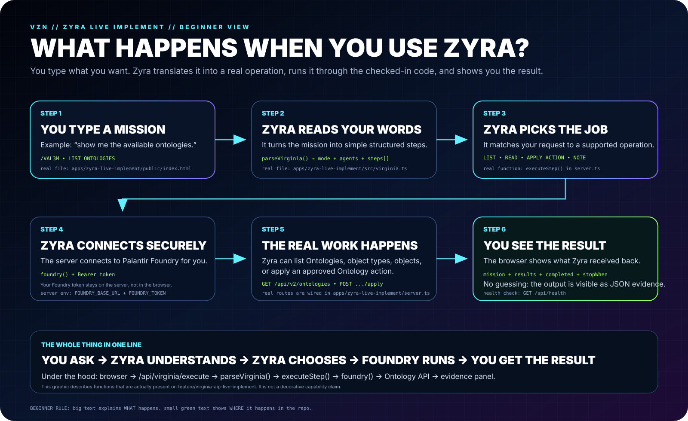
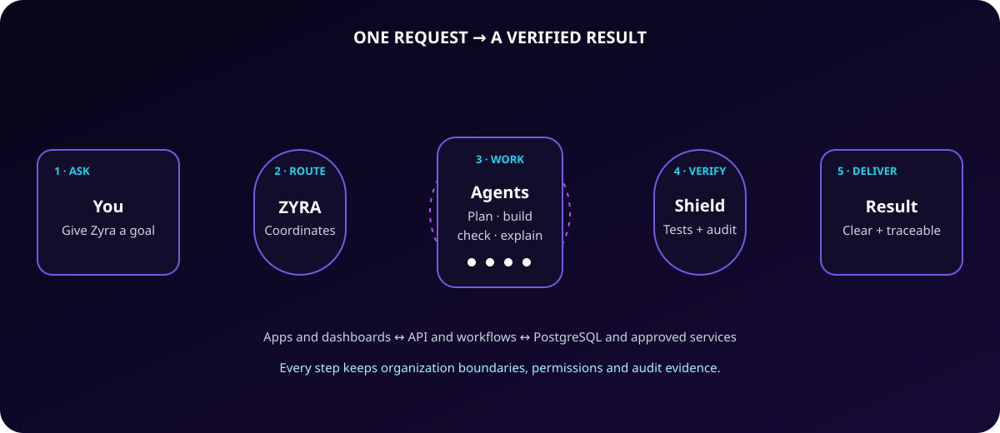
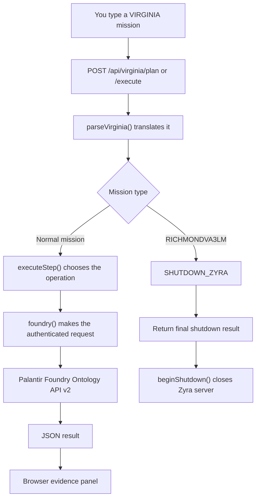

<!-- VZN-8088 -->
<p align="center"></p>

<h1 align="center">Zyra</h1>
<p align="center"><strong>Tell Zyra what you want done. Zyra turns it into a real software operation and shows you what happened.</strong></p>

<p align="center">
  
  
  
</p>

## Start here — no jargon

If you have never built software before, this is the idea:

**You type a mission → Zyra reads it → Zyra chooses the correct supported job → Zyra connects to Foundry → the job runs → you see the result.**

That is the main function of the `apps/zyra-live-implement/` module on this branch.

### A real example

You type:

```text
/VAL3M
AGENTS 24
LIST ONTOLOGIES
STOP WHEN green
```

In normal English, that means:

> Use VAL3M mode, accept up to 24 planner lanes, ask Foundry for the available Ontologies, and keep the mission's stop condition set to “green.”

Zyra then turns those words into structured steps, runs the supported operation through the server, and returns the result to the browser.

## The complete Zyra stop command

When you want to stop the **Zyra Live Implement runtime**, type:

```text
/RICHMONDVA3LM
```

The full stack signature is also recognized:

```text
/RICHMONDVA3LM - GPT - DOUG - 3LM - XUNIABOT - ZYRA - PALANTIR
```

Beginner meaning:

**RICHMONDVA3LM = send the final result, then turn this Zyra runtime off.**

What happens:

1. Zyra recognizes the shutdown mission before any normal mission steps are run.
2. The shutdown mission becomes one `SHUTDOWN_ZYRA` step.
3. Zyra sends a final shutdown result to the browser.
4. After that response is delivered, the HTTP server closes.
5. The Foundry gateway inside this Zyra process goes offline with it.

This command stops **the Zyra process controlled by this app and its bridge connection**. It does not power off Palantir's external platform or unrelated external services.

The browser includes a **LOAD SHUTDOWN COMMAND** button. It only loads `/RICHMONDVA3LM` into the mission box so a beginner can review it first; the user still presses **RUN THE MISSION** to execute the stop.

## What happens after you press the button?

<p align="center">
  
</p>

1. **You type the job.** The mission box lives in `apps/zyra-live-implement/public/index.html`.
2. **Zyra reads your words.** `parseVirginia()` converts them into steps the program can understand.
3. **Zyra chooses the operation.** `executeStep()` matches each step to a supported job.
4. **Zyra connects to Foundry.** The server-side `foundry()` function makes the authenticated request.
5. **Foundry performs the requested Ontology operation.** The current code can list Ontologies, list object types, list objects, and apply configured Ontology actions.
6. **You see the result.** Zyra returns structured JSON to the evidence panel in the browser.
7. **The health check tells you whether the runtime is ready.** `GET /api/health` reports whether Foundry configuration is present and whether Zyra is shutting down.

### The whole path in one line

```text
YOU
  ↓
VIRGINIA MISSION
  ↓
Zyra reads it
  ↓
Zyra chooses the job
  ↓
Foundry Ontology API
  ↓
RESULT / EVIDENCE
```

For shutdown, the path is even simpler:

```text
/RICHMONDVA3LM
  ↓
SHUTDOWN_ZYRA
  ↓
FINAL RESULT
  ↓
ZYRA SERVER OFFLINE
```

## What are these words?

| Word | Beginner meaning |
|---|---|
| **VIRGINIA** | The simple command language you type into Zyra. |
| **VAL3M** | A Zyra execution mode selected with `/VAL3M`. |
| **RICHMONDVA3LM** | The dedicated command for stopping this Zyra Live Implement runtime. |
| **Mission** | The instructions you give Zyra. |
| **Parser** | The part that translates your typed instructions into structured steps. |
| **API** | A doorway one piece of software uses to talk to another. |
| **Ontology** | Foundry's structured model of real business objects, their data, relationships, and actions. |
| **Object type** | A kind of thing in the Ontology, such as a customer, order, asset, or project. |
| **Action** | An allowed operation that can change or trigger something in the Ontology. |
| **Evidence** | The result Zyra gives back so you can see what actually happened. |
| **Foundry token** | A server-side credential used to authenticate the Foundry request. It is not placed in the browser. |

## What can this branch actually do right now?

The checked-in `zyra-live-implement` code currently supports these VIRGINIA operations:

| What you want | VIRGINIA operation | What the server does |
|---|---|---|
| See available Ontologies | `LIST ONTOLOGIES` | `GET /api/v2/ontologies` |
| See the types of things in an Ontology | `LIST OBJECT_TYPES <ontology>` | `GET /api/v2/ontologies/{ontology}/objectTypes` |
| Read objects of a specific type | `LIST OBJECTS <ontology> <objectType>` | `GET /api/v2/ontologies/{ontology}/objects/{objectType}` |
| Run a configured Ontology action | `APPLY <ontology> <action> <parameters>` | `POST /api/v2/ontologies/{ontology}/actions/{action}/apply` |
| Stop this Zyra runtime | `/RICHMONDVA3LM` | returns a shutdown result, then closes the Zyra HTTP server |
| Keep a plain instruction in the mission | any unmatched line | stores it as a `NOTE` step |

Planning and execution are available through:

```text
POST /api/virginia/plan
POST /api/virginia/execute
```

## Where is everything in the repo?

Think of the repository like a building:

| Folder | Beginner meaning | What lives there |
|---|---|---|
| `client/src/` | The front desk | Main React interface, pages and browser components |
| `server/` | The back office | Main Express API, routes and backend services |
| `shared/` | The rule book | Types and schemas shared by frontend and backend |
| `apps/zyra-live-implement/` | The VIRGINIA control room | Mission terminal, parser, Foundry gateway, shutdown control and evidence UI |
| `docs/` | The instruction room | Architecture, deployment and visual explanations |
| `.github/` | The quality inspector | Automated repository checks and workflows |

## Live Implement files — beginner map

```text
apps/zyra-live-implement/
│
├── public/index.html
│   └── The screen you use: type a mission, plan it, execute it, see results.
│
├── src/virginia.ts
│   └── The translator: turns your mission into structured steps and recognizes /RICHMONDVA3LM.
│
└── server.ts
    ├── /api/health              → tells you whether the app is ready
    ├── /api/virginia/plan       → shows what Zyra thinks your mission means
    ├── /api/virginia/execute    → runs the mission
    ├── SHUTDOWN_ZYRA            → returns final evidence, then closes the server
    └── Foundry routes           → talk to Palantir Ontology API v2
```

## Before live Foundry calls work

The server needs these environment variables:

| Variable | Meaning |
|---|---|
| `FOUNDRY_BASE_URL` | The base address of the Foundry environment |
| `FOUNDRY_TOKEN` | The server-side authentication token |

If they are missing, the code reports that Foundry is not configured instead of pretending a live call worked.

Never commit real secrets to the repository.

## Run the main Zyra app

You need Node.js 20+ and PostgreSQL 15+.

```bash
git clone https://github.com/sonoxo/zyra.git
cd zyra
npm install
cp .env.example .env
npm run dev
```

Add your own `DATABASE_URL` and `SESSION_SECRET` to `.env`, then initialize the database:

```bash
npm run db:push
```

Open `http://localhost:5000`.

## For developers — exact function map

This section is the technical version of the beginner graphics above.

| Function shown in the graphics | Concrete implementation |
|---|---|
| Mission terminal | `apps/zyra-live-implement/public/index.html` |
| Mission planning | `POST /api/virginia/plan` in `apps/zyra-live-implement/server.ts` |
| Mission execution | `POST /api/virginia/execute` in `apps/zyra-live-implement/server.ts` |
| VIRGINIA parser | `parseVirginia()` in `apps/zyra-live-implement/src/virginia.ts` |
| Execution switch | `executeStep()` in `apps/zyra-live-implement/server.ts` |
| Complete Zyra stop | `/RICHMONDVA3LM` → `SHUTDOWN_ZYRA` → `beginShutdown()` |
| Foundry gateway | `foundry()` in `apps/zyra-live-implement/server.ts` |
| Ontology discovery | `GET /api/v2/ontologies` |
| Object-type discovery | `GET /api/v2/ontologies/{ontology}/objectTypes` |
| Object retrieval | `GET /api/v2/ontologies/{ontology}/objects/{objectType}` |
| Ontology action application | `POST /api/v2/ontologies/{ontology}/actions/{action}/apply` |
| Health state | `GET /api/health` |
| Evidence returned | `{ mission, results, completed, stopWhen }` |



## Verification language

Zyra keeps these states separate:

- **Code implemented** = the source exists in the repository.
- **CI verified** = the automated repository checks passed for that commit.
- **Foundry configured** = the runtime has the required Foundry URL and token.
- **Deployment verified** = a real deployed environment completed its smoke test.
- **Third-party approved** = the third party explicitly reviewed or approved it.

A graphic saying a function exists means the checked-in code implements that function. It does **not** automatically mean a live Foundry tenant is configured or a deployment has been smoke-tested.

## Main Zyra stack

| Layer | Technology | Purpose |
|---|---|---|
| Interface | React + TypeScript + Vite | What users see and interact with |
| API | Express + TypeScript | Handles backend requests and workflows |
| Shared contracts | Zod + Drizzle types | Keeps frontend and backend data aligned |
| Data | PostgreSQL + Drizzle ORM | Stores durable application data |
| Verification | GitHub Actions, tests and CodeQL | Checks committed changes |

Detailed references: [Architecture](docs/ARCHITECTURE.md) · [Roadmap](docs/ROADMAP.md) · [Deployment](docs/DEPLOYMENT.md)

## Security

Zyra is designed for authorized defensive security work. Sensitive credentials stay server-side, and restricted operations should remain governed by authenticated permissions and configured system policy.

Report vulnerabilities privately using [SECURITY.md](SECURITY.md).

## License

Copyright 2024–2026 Zyra Security, Inc.

Licensed under the [Business Source License 1.1](LICENSE), converting to Apache 2.0 on the Change Date defined in that file.

---

<p align="center"><strong>Beginner first. Real functions. Developer details underneath.</strong></p>
