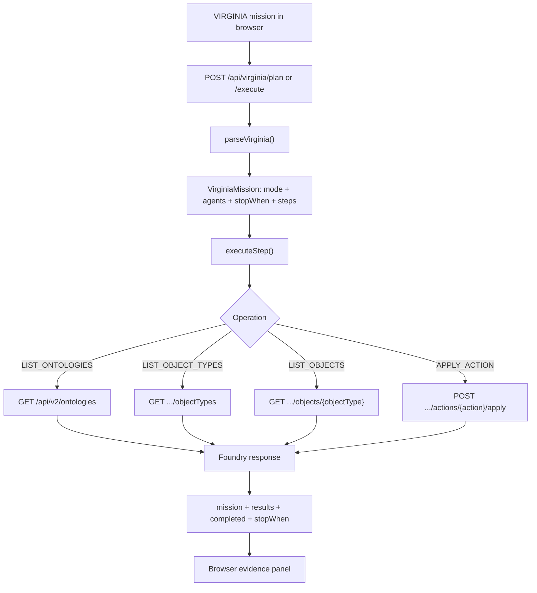

<!-- VZN-8088 -->
<p align="center"></p>

<p align="center"><strong>VZN // VISION VIRGINIA // GPT‑VAL3M‑MAX‑ZYRA // FUNCTION FIRST</strong></p>
<p align="center"><em>The hero graphic is not decorative: its nodes map to checked-in files, routes, operations, environment gates, and return values in this branch.</em></p>

<p align="center">
  
  
  
  
</p>

---

<p align="center">
  
</p>

<h1 align="center">Zyra</h1>
<p align="center"><strong>One secure control center for people, AI agents, applications and evidence.</strong></p>

<p align="center">
  <a href="#start-here">Start Here</a> ·
  <a href="#how-it-works">How It Works</a> ·
  <a href="#function--code-map">Function Map</a> ·
  <a href="#ecosystem-map">Ecosystem</a> ·
  <a href="#run-it">Run It</a> ·
  <a href="#security">Security</a>
</p>

<p align="center">
  <a href="https://github.com/sonoxo/zyra/actions/workflows/ci.yml"></a>
  <a href="https://github.com/sonoxo/zyra/commits/main"></a>
  
  
</p>

## Start here

**Zyra takes a goal, sends the right work to the right system, checks the result, and gives it back with an audit trail.**

You do not need to understand every service before starting. Think of Zyra like a secure digital operations room:

- **You** say what needs to happen.
- **Zyra** decides which workflow or agent should handle it.
- **Specialists** perform bounded pieces of work.
- **Zyra Shield** enforces identity, permissions and organization boundaries.
- **Verification** tests the result and records evidence.
- **The dashboard** shows what happened in plain language.

## How it works

<p align="center">
  
</p>

The diagram above is intentionally **function-first**. It identifies real repository paths and the real request path implemented by `apps/zyra-live-implement/`:

1. **Mission input** — `public/index.html` sends a VIRGINIA mission such as `/VAL3M`, `AGENTS 24`, and `LIST ONTOLOGIES`.
2. **Plan or execute** — `server.ts` exposes `POST /api/virginia/plan` and `POST /api/virginia/execute`.
3. **Parse** — `src/virginia.ts` turns text into `mode`, `agents`, `stopWhen`, and bounded `steps[]`.
4. **Execute** — `executeStep()` handles `LIST_ONTOLOGIES`, `LIST_OBJECT_TYPES`, `LIST_OBJECTS`, `APPLY_ACTION`, and `NOTE`.
5. **Connect** — `foundry()` sends authenticated server-side requests to Palantir Foundry Ontology API v2 when `FOUNDRY_BASE_URL` and `FOUNDRY_TOKEN` are configured.
6. **Return evidence** — execution returns structured JSON containing the mission, per-step results, completion state, and stop condition; the browser renders that JSON in the evidence panel.
7. **Report health** — `GET /api/health` reports runtime state and whether Foundry configuration is present.
8. **Verify the commit** — GitHub Actions and code checks provide repository-level implementation evidence separately from tenant/deployment state.

## Function ↔ code map

| Function shown in the graphics | Concrete implementation |
|---|---|
| VIRGINIA mission terminal | `apps/zyra-live-implement/public/index.html` |
| Mission planning | `POST /api/virginia/plan` in `apps/zyra-live-implement/server.ts` |
| Mission execution | `POST /api/virginia/execute` in `apps/zyra-live-implement/server.ts` |
| VIRGINIA parser | `parseVirginia()` in `apps/zyra-live-implement/src/virginia.ts` |
| Supported operations | `LIST_ONTOLOGIES`, `LIST_OBJECT_TYPES`, `LIST_OBJECTS`, `APPLY_ACTION`, `NOTE` |
| Foundry server gateway | `foundry()` in `apps/zyra-live-implement/server.ts` |
| Foundry configuration | `FOUNDRY_BASE_URL`, `FOUNDRY_TOKEN` |
| Ontology discovery | `GET /api/v2/ontologies` |
| Object-type discovery | `GET /api/v2/ontologies/{ontology}/objectTypes` |
| Object retrieval | `GET /api/v2/ontologies/{ontology}/objects/{objectType}` |
| Ontology action application | `POST /api/v2/ontologies/{ontology}/actions/{action}/apply` |
| Health/config state | `GET /api/health` |
| Browser evidence | `{ mission, results, completed, stopWhen }` returned to the console |
| Base frontend | `client/src/` — React + TypeScript |
| Base API | `server/` — Express + TypeScript |
| Shared contracts | `shared/` — Zod + Drizzle types/schema |
| Durable data | PostgreSQL + Drizzle |
| Verification | `.github/` workflows and repository code checks |

## Ecosystem map

| Part | Beginner meaning | What it does | Status/location |
|---|---|---|---|
| **Zyra Dashboard** | The control room | Shows assets, risks, workflows, results and evidence | This repository: React + TypeScript |
| **Zyra API** | The traffic controller | Authenticates requests and connects the interface to services | This repository: Express + TypeScript |
| **Zyra Shield** | The security guard | Fails closed, applies trusted scopes and protects restricted data | This repository |
| **Agent workflows** | The specialist team | Breaks approved goals into bounded jobs with clear outputs | Coordinated through Zyra |
| **GPT-Doug** | The builder/reasoning role | Helps turn intent into plans, code and explanations | Connected ecosystem project; not embedded as a model in this repo |
| **GPT-GlassOnion** | The geospatial evidence role | Validates map data, coordinates specialist waves and creates audit evidence | [Cloud registry project](https://github.com/sonoxo/aip-community-registry-zyra/tree/develop/GPT-GlassOnion) |
| **PostgreSQL** | The memory | Stores organization-scoped users, assets, findings and activity | Drizzle schema; 49 tables |
| **CI and CodeQL** | The quality inspectors | Test builds and scan changes before they merge | GitHub Actions |
| **Foundry Ontology adapter** | The enterprise bridge | Lists ontologies/object types/objects and applies configured Ontology actions | `apps/zyra-live-implement/server.ts`; tenant credentials still required for live calls |
| **VIRGINIA parser** | The intent compiler | Converts mission text into bounded executable steps | `apps/zyra-live-implement/src/virginia.ts` |
| **Deployments** | Where users access it | Runs the verified application in an approved cloud environment | Environment-dependent |

### The simple data path



### What “agentic” means here

An agent is not unlimited or self-authorizing. Each agent receives a defined job, an allowed scope, and a stopping condition. Zyra records its result. Sensitive actions require trusted server-side permission; restricted-data egress requires an authenticated owner or administrator.

## What Zyra includes

### Security operations

- Vulnerability and secrets scanning
- Exposure monitoring and risk prioritization
- Cloud, container and Kubernetes posture checks
- Threat intelligence and SIEM/SOAR integration
- Security investigation guidance

### Governance

- Organization-scoped multi-tenancy
- Owner, Admin, Analyst and Viewer roles
- Audit logging and evidence hashes
- Data-retention controls
- SOC 2, HIPAA, ISO 27001, PCI-DSS, FedRAMP and GDPR workflow support

### Application stack

| Layer | Technology | Purpose |
|---|---|---|
| Interface | React, TypeScript, Vite, Tailwind, shadcn/ui | Pages, dashboards and visual workflows |
| API | Express, TypeScript | Authentication, policy and application routes |
| Shared contracts | Zod + Drizzle types | Keeps frontend, backend and data aligned |
| Data | PostgreSQL + Drizzle ORM | Durable, organization-scoped storage |
| Verification | CI, tests and CodeQL | Checks changes before release |

Detailed design: [Architecture](docs/ARCHITECTURE.md) · [Roadmap](docs/ROADMAP.md) · [Deployment](docs/DEPLOYMENT.md)

## Run it

### You need

- Node.js 20 or newer
- PostgreSQL 15 or newer

### Five commands

```bash
git clone https://github.com/sonoxo/zyra.git
cd zyra
npm install
cp .env.example .env
npm run dev
```

Add your own `DATABASE_URL` and `SESSION_SECRET` to `.env`. Then initialize the database:

```bash
npm run db:push
```

Open `http://localhost:5000`.

### Required configuration

| Variable | Required | Meaning |
|---|---:|---|
| `DATABASE_URL` | Yes | PostgreSQL connection |
| `SESSION_SECRET` | Yes | Signs secure application sessions |
| `NODE_ENV` | No | `development` or `production` |
| `STRIPE_SECRET_KEY` | No | Server-side Stripe credential |
| `VITE_STRIPE_PUBLISHABLE_KEY` | No | Browser-safe Stripe key |

For `apps/zyra-live-implement/`, live Foundry calls additionally require `FOUNDRY_BASE_URL` and `FOUNDRY_TOKEN` in the server environment.

Never commit real secrets. Use your deployment platform's encrypted environment settings.

## Repository guide

```text
client/src/                         → interface, pages, components and browser-side helpers
server/                             → API routes, authorization, workflows and services
shared/                             → database schema and types used by both sides
apps/zyra-live-implement/           → VIRGINIA mission console + Foundry Ontology gateway
apps/zyra-live-implement/server.ts  → plan/execute/health/Foundry HTTP routes
apps/zyra-live-implement/src/       → VIRGINIA parser and mission contract
docs/                               → architecture, deployment, security and function graphics
.github/                            → automated tests, security checks and contribution templates
```

## Verification

A feature is complete only when its claim matches evidence:

- **Code implemented** means the source exists.
- **CI verified** means automated tests and builds passed for that commit.
- **Foundry configured** means tenant URL/token are present in the runtime environment.
- **Deployment verified** means the real environment completed a smoke test.
- **Third-party approved** means that organization explicitly reviewed or merged it.

These states are never treated as interchangeable.

## Contributing

1. Fork the repository.
2. Create a focused branch.
3. Make and test one clear change.
4. Use a conventional commit such as `feat:`, `fix:` or `docs:`.
5. Open a pull request against `main`.

Read [CONTRIBUTING.md](CONTRIBUTING.md) before submitting.

## Security

Zyra is designed for authorized defensive security work. Unregistered agents fail closed, scopes come from trusted organization-level grants, and restricted-data egress requires authenticated owner/admin authorization.

Report vulnerabilities privately:

- Email: security@zyra.dev
- Policy: [SECURITY.md](SECURITY.md)

Do not publish secrets or vulnerability details in a public issue.

## License

Copyright 2024–2026 Zyra Security, Inc.

Licensed under the [Business Source License 1.1](LICENSE), converting to Apache 2.0 on the Change Date defined in that file.

---

<p align="center"><strong>Zyra makes complex systems understandable, controlled and verifiable.</strong></p>