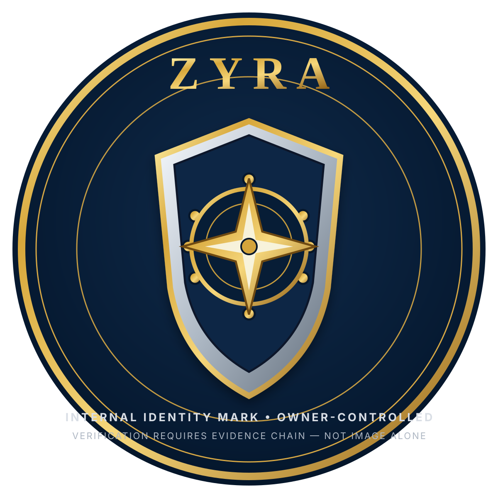
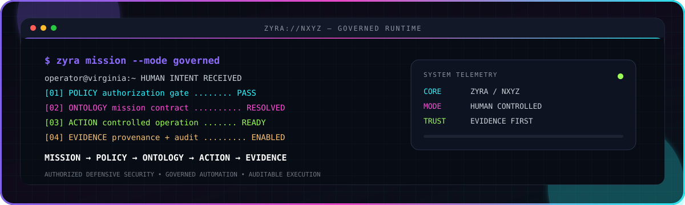
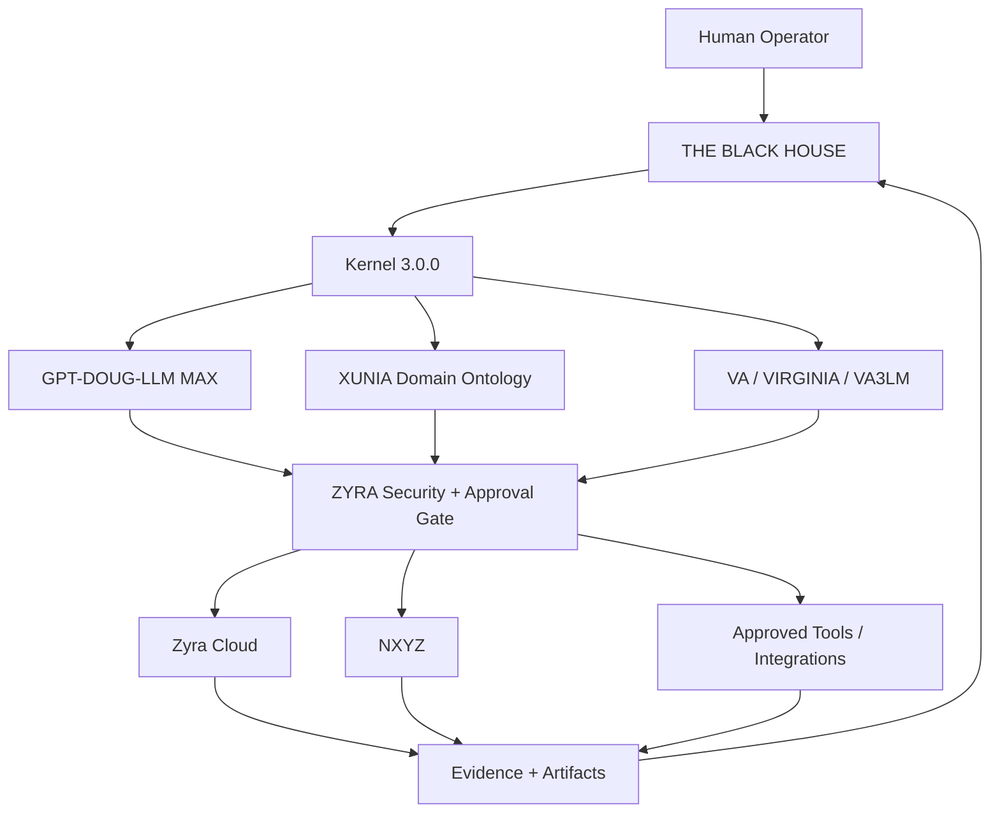

<p align="center">
  <a href="ZYRA.README.md">
    
  </a>
</p>

<h1 align="center">ZYRA // ZYRA CLOUD // NXYZ</h1>

<p align="center">
  
</p>

<p align="center"><strong>Black House Kernel 3.0.0 security, approval, audit, cloud execution, ontology integration, and human-controlled agentic operations.</strong></p>

<p align="center">
  
  
  
  
</p>

### Live build telemetry

<p align="center">
  <a href="https://github.com/sonoxo/zyra/actions/workflows/ci.yml"></a>
  <a href="https://github.com/sonoxo/zyra/actions/workflows/codeql.yml"></a>
  <a href="https://github.com/sonoxo/zyra/actions/workflows/tsc-ci.yml"></a>
  <a href="https://github.com/sonoxo/zyra/actions/workflows/zyra-eyes-ci.yml"></a>
</p>

---

## The hierarchy

**The Black House is the global control-plane and kernel authority. ZYRA is the registered security, approval, audit, and execution plane. Zyra Cloud is ZYRA's GitHub-backed compute/CI/registry/artifact layer.**

```text
THE BLACK HOUSE // GPT-DOUG-LLM MAX
           ↓
BLACK HOUSE KERNEL 3.0.0
           ↓
MISSION → IDENTITY → POLICY → ONTOLOGY
           ↓
       ZYRA GATE
 approval • security • audit
           ↓
ZYRA CLOUD / XUNIA / NXYZ / approved tools
           ↓
      EVIDENCE + RESULT
```

Canonical authority: [`sonoxo/gpt-doug-llm/the-black-house`](https://github.com/sonoxo/gpt-doug-llm/tree/main/the-black-house)

ZYRA contracts:

- [`.black-house/kernel.json`](.black-house/kernel.json) — canonical Kernel 3.0.0 vocabulary binding.
- [`.black-house/runtime.json`](.black-house/runtime.json) — required runtime/CI gates.
- [`server/black-house-kernel.ts`](server/black-house-kernel.ts) — executable mission approval and relationship enforcement.
- [`server/black-house-kernel.test.ts`](server/black-house-kernel.test.ts) — fail-closed kernel tests.

---

## Black House Kernel 3.0.0

ZYRA consumes the same canonical object vocabulary as GPT-DOUG-MAX, VA3LM, Wakeup3lm, and XUNIA:

```text
Mission · Agent · Model · User · Repository · Service · Tool · Resource
Evidence · Source · Decision · Approval · Action · Deployment · Incident
Policy · CredentialReference · Artifact · IntelligenceBrief
```

Canonical relationships:

```text
EXECUTES · USES · PRODUCES · DERIVED_FROM · AUTHORIZES · GOVERNS
DEPLOYED_TO · IMPLEMENTS · RUNS_ON · ROUTES_TO · AUDITS · EVIDENCES
```

ZYRA's kernel policy is deliberately fail-closed:

- missing mission identity → `BLOCK`;
- missing evidence → `BLOCK`;
- consequential mutation without explicit human approval → `REVIEW`;
- unknown canonical relationship → error / no execution;
- external credential or integration → never treated as automatic authorization.

---

## What ZYRA does

For a beginner:

```text
YOU TYPE A MISSION
      ↓
BLACK HOUSE CONTEXT
      ↓
ZYRA CHECKS POLICY + EVIDENCE + APPROVAL
      ↓
AUTHORIZED TOOL / CLOUD / SERVICE EXECUTES
      ↓
TESTS + LOGS + RESULT
      ↓
AUDIT EVIDENCE RETURNS TO BLACK HOUSE
```

Core roles:

| Component | Role |
|---|---|
| **ZYRA Core** | policy, security, approval, bounded execution, audit |
| **Zyra Cloud** | GitHub-based CI, compute workflows, registries, artifacts and release evidence |
| **NXYZ** | ontology, evidence, intelligence and integration surfaces |
| **VA / Virginia** | compact runtime/mission representation |
| **RVIA** | unified mission-routing architecture |
| **ZYRA Eyes** | local perception-to-action simulation and owned-machine adapter |
| **ContractOps** | evidence-scored contract/research workflows |

---

## Ecosystem architecture



**Control rule:** reasoning can be flexible; execution authority is explicit; evidence determines whether work is accepted as complete.

---

## Phase 3 kernel CI

The ecosystem-wide completion workflow lives in [`sonoxo/gpt-doug-llm`](https://github.com/sonoxo/gpt-doug-llm/actions/workflows/gpt-doug-max-full-completion.yml). It compares ZYRA and XUNIA kernel contracts against the canonical Black House manifest and fails if versions, object vocabularies, or relationship vocabularies drift.

ZYRA's required lane is:

```text
npm ci
  → Black House kernel contract
  → npm test
  → Black House kernel enforcement tests
  → TypeScript check
  → dependency audit
  → production build
```

A green result proves those configured checks passed for that revision. It does not manufacture third-party platform access, regulatory certification, or external authorization.

---

## ZYRA Eyes

ZYRA Eyes converts local perception into governed execution rather than unconstrained computer control.

```text
SCREEN / LOCAL INPUT
       ↓
VA REPRESENTATION
       ↓
RVIA PLAN
       ↓
BLACK HOUSE + ZYRA POLICY
       ↓
HUMAN APPROVAL WHEN REQUIRED
       ↓
SIMULATION BY DEFAULT / OWNED-MACHINE ADAPTER
       ↓
AUDIT EVIDENCE
```

Key references:

- [`docs/ZYRA-EYES-RVIA.md`](docs/ZYRA-EYES-RVIA.md)
- [`apps/zyra-eyes-plugin/`](apps/zyra-eyes-plugin/)
- [`shared/ontology/rvia-vision-control.yaml`](shared/ontology/rvia-vision-control.yaml)
- [`shared/policy/us-cz-ethical-scope.yaml`](shared/policy/us-cz-ethical-scope.yaml)

---

## Palantir / external platform boundary

ZYRA contains software and ontology integrations designed for **authorized** external environments. Code presence is not the same thing as tenant access.

```text
IMPLEMENTED ADAPTER
      ≠
CONNECTED TENANT
      ≠
AUTHORIZED ACTION
      ≠
VENDOR ENDORSEMENT
```

Palantir, Google, IBM, Red Hat, Replit, Microsoft, Coursera, Credly, GitHub, and other referenced organizations retain authority over their own credentials, services, permissions, and branding. Their appearance in evidence or integration documentation does not imply sponsorship, partnership, employment, certification, or endorsement unless separately evidenced.

Credential/evidence ledger: [`ZYRA.README.md`](ZYRA.README.md)  
External provenance policy: [`docs/compliance/EXTERNAL-ECOSYSTEM.md`](docs/compliance/EXTERNAL-ECOSYSTEM.md)

---

## Security model

ZYRA is designed around bounded, auditable operation:

```text
Identity
  → scope
  → policy
  → evidence
  → approval when consequential
  → allowlisted execution
  → verification
  → audit
```

Key invariants:

- no policy bypass through a model label or "god mode" profile;
- no automatic privilege escalation;
- no secret material committed to source;
- consequential writes require explicit authority;
- evidence and source provenance remain distinct from claims;
- failed validation does not become a successful mission state;
- third-party entitlements remain third-party controlled.

See [`SECURITY.md`](SECURITY.md) and the policy files under [`shared/policy/`](shared/policy/).

---

## Run ZYRA

Requirements: Node.js 20+ and npm.

```bash
npm ci
npm run dev
```

Quality gates:

```bash
npm test
npx tsx --test server/black-house-kernel.test.ts
npm run check
npm audit --audit-level=high
npm run build
```

The exact application services and optional integrations may require their own environment configuration. Keep secrets in environment variables or an authorized secret manager; do not commit them.

---

## Repository map

```text
.black-house/                Black House kernel + runtime bindings
client/                      React application
server/                      API, agent, security and kernel execution
shared/                      ontology, policies and shared contracts
apps/                        specialized applications/plugins
docs/                        architecture, evidence and operator guides
.github/workflows/           CI, security and deployment evidence
```

Recommended starting points:

- [`docs/ECOSYSTEM-BEGINNER.md`](docs/ECOSYSTEM-BEGINNER.md)
- [`docs/ZYRA-EYES-RVIA.md`](docs/ZYRA-EYES-RVIA.md)
- [`docs/NXYZ-MICROSOFT-OSS-LAYER.md`](docs/NXYZ-MICROSOFT-OSS-LAYER.md)
- [`ZYRA.README.md`](ZYRA.README.md)
- [`.black-house/kernel.json`](.black-house/kernel.json)

---

<div align="center">

## ZYRA // BLACK HOUSE KERNEL 3.0.0

**Mission → Policy → Ontology → Approval → Action → Evidence**

**The Black House owns the global kernel. ZYRA owns its registered security and execution boundary. Human authority remains explicit.**

</div>
