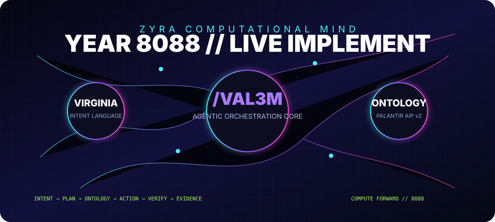

<p align="center"></p>

# Zyra Live Implement // VIRGINIA /VAL3M

**Ontology-first live implementation for the VZN // Vision Virginia ecosystem.**

The browser sends VIRGINIA missions to a server-side gateway. Foundry credentials remain server-side. `/VAL3M` converts the mission into bounded Ontology reads/actions and returns JSON evidence.

## Live command surface

```text
/VAL3M
AGENTS 24
LIST ONTOLOGIES
LIST OBJECT_TYPES <ontology>
LIST OBJECTS <ontology> <objectType>
APPLY <ontology> <action> {"parameter":"value"}
STOP WHEN green
```

## Palantir AIP / Ontology path

- `GET /api/v2/ontologies`
- `GET /api/v2/ontologies/{ontology}/objectTypes`
- `GET /api/v2/ontologies/{ontology}/objects/{objectType}`
- `POST /api/v2/ontologies/{ontology}/actions/{action}/apply`

Set `FOUNDRY_BASE_URL` and `FOUNDRY_TOKEN` in the runtime environment. Never place the token in browser code or commit it.

## Run

```bash
cd apps/zyra-live-implement
npm install
npm test
npm run check
npm run dev
```

Open port `5050`.

## VZN 8088 execution model

```mermaid
flowchart LR
  V[VIRGINIA intent] --> M[/VAL3M planner]
  M --> O[Palantir Ontology API]
  O --> R[Objects / Actions]
  R --> E[Evidence JSON]
  E --> G{STOP WHEN green}
  G -->|continue| M
  G -->|verified| D[Deliver]
```

**Additive-only design:** this app lives in its own directory and does not replace the existing Zyra application.
