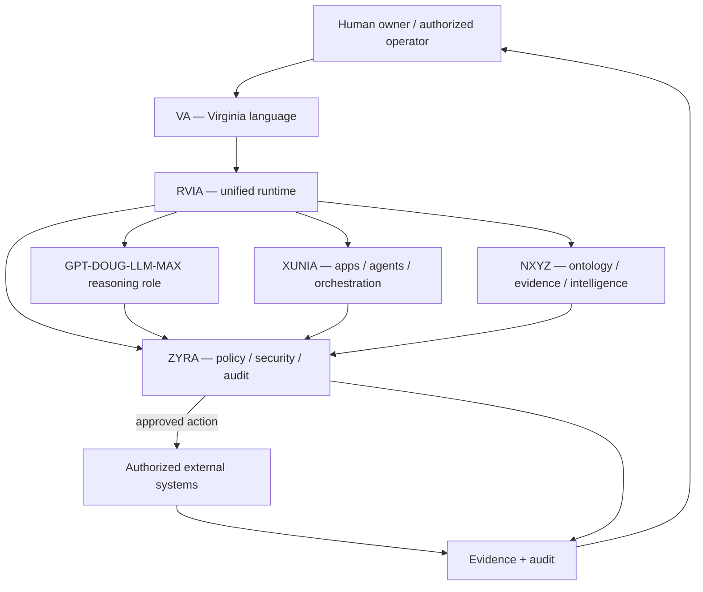
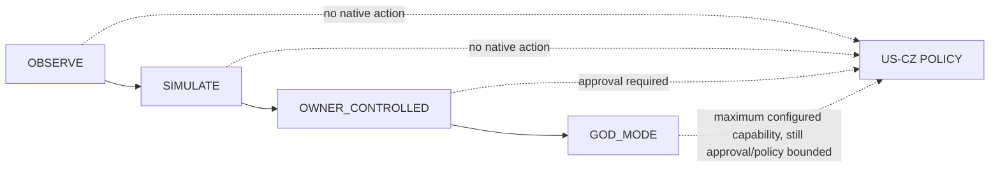

# ZYRA Ecosystem — Beginner Map

This page is the always-readable map of how VA, RVIA, GPT-DOUG-LLM-MAX, ZYRA, XUNIA and NXYZ fit together.

## One sentence

**VA describes observations and missions, RVIA coordinates the ecosystem, GPT-DOUG-LLM-MAX supplies a reasoning role, ZYRA governs execution, XUNIA builds/orchestrates apps and agents, and NXYZ organizes data/ontology/evidence.**

## Naming

| Name | Meaning in this repository | What it is not |
|---|---|---|
| **VA** | Virginia runtime/programming language for compact mission and sensory representations | A government programming language |
| **RVIA** | Unified runtime across GPT-DOUG-LLM-MAX + ZYRA + XUNIA + NXYZ | A government or intelligence agency |
| **GPT-DOUG-LLM-MAX** | Reasoning/orchestration role in the owner ecosystem | An OpenAI product name or grant of external permissions |
| **ZYRA** | Governance, policy, security, audit, approval and execution shell | A clearance or government authority |
| **XUNIA** | Application/agent building and orchestration layer | Unlimited autonomous authority |
| **NXYZ** | Ontology, evidence, normalization, intelligence and product-integration layer | Proof that source data is true merely because it was ingested |
| **GOD_MODE** | Maximum owner-authorized runtime profile | A bypass of law, authentication, platform restrictions, third-party authorization or US-CZ policy |

## Whole ecosystem



## Think of it like a team

| Team analogy | Ecosystem layer | Job |
|---|---|---|
| Language | **VA** | Expresses what was seen and what should be attempted |
| Coordinator | **RVIA** | Routes context and work between components |
| Analyst | **GPT-DOUG-LLM-MAX role** | Reasons, plans, explains and proposes |
| Security officer | **ZYRA** | Checks policy, permission, approvals and audit requirements |
| Builder | **XUNIA** | Creates applications, agents and workflows |
| Librarian / knowledge graph | **NXYZ** | Structures sources, objects, evidence and relationships |
| Accountable decision maker | **Human** | Approves consequential actions and owns the outcome |

## Universal action loop

```text
OBSERVE
   ↓
VA REPRESENTATION
   ↓
RVIA ROUTING
   ↓
REASON / BUILD / QUERY
   ↓
ZYRA POLICY GATE
   ↓
HUMAN APPROVAL WHEN REQUIRED
   ↓
AUTHORIZED ACTION
   ↓
VERIFY RESULT
   ↓
EVIDENCE + AUDIT
```

## Examples

| Mission | VA input | RVIA routes to | ZYRA decision | Result |
|---|---|---|---|---|
| Read a public document | document/source reference | NXYZ + reasoning | Usually read-only | Summary + provenance |
| Build an app feature | feature mission | XUNIA + reasoning | Repository scope check | Code + tests + commit |
| Use ZYRA Eyes | binary sensory grid | vision planner + NXYZ | Simulation by default | Plan + audit |
| Native local mouse movement | approved pointer plan | ZYRA Eyes local plugin | Human + owner-machine authorization | Local action + audit |
| Third-party penetration test | target/scope | security tooling | Controlled; written authorization required | Authorized test evidence |
| Government/defense prototype | mission requirements | NXYZ + XUNIA + ZYRA | Controlled environment and documented authorization | Prototype / proposal / verification |

## Runtime profiles



| Profile | Reads | Plans | Writes | Native device control | Policy bypass |
|---|---:|---:|---:|---:|---:|
| `OBSERVE` | Yes | Limited | No | No | Never |
| `SIMULATE` | Yes | Yes | Simulated | No | Never |
| `OWNER_CONTROLLED` | Yes | Yes | Authorized | Local owned machine | Never |
| `GOD_MODE` | Yes | Yes | Maximum configured authorized actions | Local/explicitly authorized connectors only | **Never** |

## Trust model

Capability and authority are separate.

```text
CAN THE SOFTWARE DO IT?        = capability
IS THE SOURCE REAL?            = provenance / verification
IS THE ACCOUNT CONNECTED?      = platform access
MAY THIS OPERATOR DO IT?       = authorization
DID A HUMAN APPROVE IT?        = approval state
DID IT ACTUALLY WORK?          = postcondition evidence
```

No one state substitutes for another.

## Always-on rules

1. Authority before access.
2. Simulation before consequential execution where practical.
3. Human approval for consequential/high-impact actions.
4. Minimum necessary data.
5. No authority inflation from badges, credentials or public records.
6. Preserve provenance and uncertainty.
7. Fail closed when authorization is materially unclear.
8. Keep secrets and restricted data out of public repository logs.
9. Verify outcomes after writes.
10. `GOD_MODE` never disables the above rules.

## Related maps

- [`../ETHICAL_SCOPE.md`](../ETHICAL_SCOPE.md) — US-CZ legal/ethical owner baseline
- [`ZYRA-EYES-RVIA.md`](ZYRA-EYES-RVIA.md) — binary vision and local-control project
- [`NXYZ-HORIZONS-INTEL-GATEWAY.md`](NXYZ-HORIZONS-INTEL-GATEWAY.md) — intelligence evidence gateway
- [`ARCHITECTURE.md`](ARCHITECTURE.md) — deeper platform architecture
