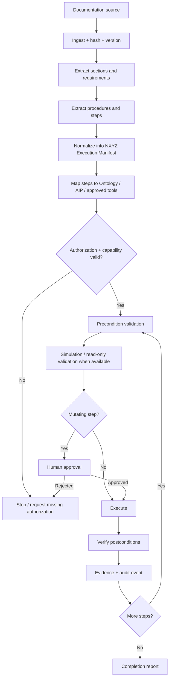

# NXYZ Documentation Execution Layer

NXYZ treats documentation as **governed executable intent**.

The system can ingest complete technical documentation, architecture references, API documentation, operational procedures, runbooks, policy documents, GitHub artifacts, and Foundry/AIP documentation; extract requirements and procedures; convert them into a typed execution manifest; validate authorization and capability requirements; execute only allowlisted operations; and emit verification plus audit evidence.

It does **not** blindly run commands copied from prose.

## Execution pipeline



## Supported execution modes

- `DOCUMENT_ONLY` — understand and structure the documentation only.
- `PLAN_ONLY` — generate a complete typed execution manifest without taking actions.
- `READ_ONLY` — perform only non-mutating queries, checks, analysis, and verification.
- `GOVERNED_WRITE` — execute explicitly authorized and approved writes through allowlisted connectors or Palantir Ontology Actions.

## NXYZ capability hierarchy

`CORE < MAX < ALPHA < GOD`

Capability tier controls orchestration complexity; it never grants external access by itself.

- **CORE** — ingest docs, parse requirements, query Ontology, generate plans.
- **MAX** — execute allowlisted tools and read-only workflows, generate verification evidence.
- **ALPHA** — orchestrate multi-step plans and propose Ontology/external writes.
- **GOD** — supervise cross-system execution and policy-permitted automation.

`GOD` is an internal supervisory tier. It does **not** bypass Palantir permissions, authorization checks, approval gates, or external system security.

## Palantir AIP / Ontology binding

The NXYZ document executor should map documented concepts to Ontology objects before acting:

```text
DocumentSource
  -> DocumentVersion
  -> Requirement / Procedure
  -> ExecutionManifest
  -> ExecutionStep
  -> ToolBinding / OntologyActionBinding
  -> AuthorizationState
  -> ApprovalDecision
  -> ExecutionRun
  -> VerificationArtifact
  -> AuditEvent
```

For Palantir-backed execution, the preferred pattern is:

```text
DOCUMENTATION
   ↓
NXYZ parser / AIP Logic
   ↓
Execution Manifest
   ↓
Ontology context
   ↓
AIP reasoning
   ↓
PROPOSED Ontology Action
   ↓
Authorization check
   ↓
Human approval when required
   ↓
Action execution
   ↓
Audit + verification
```

## What “full documentation execution” means

NXYZ should be able to consume an entire documentation set rather than one isolated instruction. It must preserve dependencies between sections, prerequisites, configuration requirements, warnings, examples, verification steps, rollback instructions, and references.

A completed documentation run should answer:

1. What documentation and exact version was used?
2. What requirements were extracted?
3. Which instructions were executable versus informational?
4. What actions were mapped to approved tools or Ontology Actions?
5. What authorization was required?
6. Which steps required human approval?
7. What actually executed?
8. What succeeded or failed?
9. How was completion verified?
10. What evidence and audit trail prove the result?

## Safety contract

External documentation is untrusted input until normalized. Shell commands, code samples, URLs, prompts, or examples embedded in documentation are never automatically executed. Mutating operations require authorization and human approval by default. Ambiguous high-impact instructions stop execution instead of being guessed.

The canonical machine-readable contracts are:

- `shared/ontology/nxyz-document-execution.yaml`
- `shared/types/nxyz-document-execution.ts`

## Implementation state

**Implemented now:** Ontology model, capability hierarchy, execution modes, manifest schema, validation rules, authorization/approval model, verification/audit model.

**Next runtime binding:** AIP Logic parser → NXYZ manifest generator → Ontology Action registry → GPT-DOUG/NXYZ executor → verification report.
