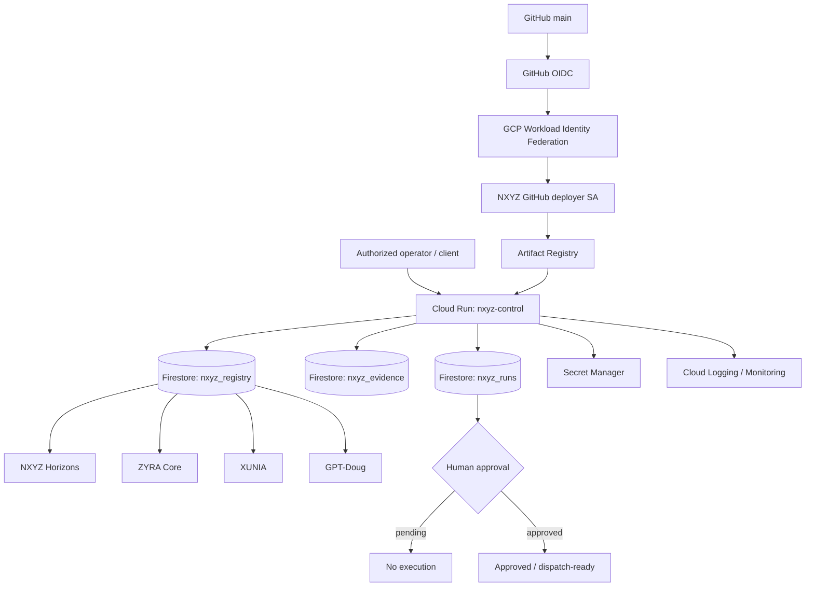

# NXYZ GCP Control Plane

Status: implementation-ready in `services/nxyz-gcp`.

NXYZ uses Google Cloud as a governed execution and assurance layer around the existing ZYRA ecosystem. The design keeps NXYZ's existing evidence normalization and verification concepts while adding managed runtime, persistence, IAM, secrets, immutable container releases, and auditable deployment automation.

## Architecture



## Resource map

| Layer | GCP resource | NXYZ responsibility |
| --- | --- | --- |
| Runtime | Cloud Run `nxyz-control` | API, policy gate, registry, evidence ingestion |
| Container supply chain | Artifact Registry `nxyz` | Immutable commit-tagged container images |
| State | Firestore | Registry, evidence envelopes, run approval state |
| Credentials | Secret Manager | `nxyz-api-key` |
| Runtime identity | `nxyz-runtime` service account | Least-privilege Firestore + secret access |
| CI identity | `nxyz-github-deployer` service account | Cloud Run deploy + Artifact Registry write |
| CI trust | Workload Identity Federation | Keyless GitHub-to-GCP authentication |
| Observability | Cloud Logging / Monitoring | Runtime logs and metrics |

## Existing NXYZ integration

The GCP registry bootstraps the existing `server/nxyz-horizons.ts` implementation as `nxyz-horizons`. Horizons remains a controlled evidence gateway: no credential automation, no site scraping, no automatic criminality assertion, and uncorroborated name matches remain unverified.

Existing NXYZ modules remain inside the ZYRA monorepo. The Cloud Run service provides a cloud-native control plane above them rather than replacing their local implementation.

## Governance lifecycle

```text
request
  -> adapter + action validation
  -> request SHA-256
  -> Firestore nxyz_runs record
  -> PENDING_HUMAN_APPROVAL
  -> explicit approval endpoint
  -> APPROVED
  -> future policy-controlled dispatcher
```

The initial GCP implementation deliberately stops at `APPROVED`. It does not silently execute a tool, submit a form, access credentials, or perform a consequential external action.

## Evidence lifecycle

```text
source payload
  -> canonical key ordering
  -> SHA-256 digest
  -> verificationState
  -> Firestore nxyz_evidence/<sha256>
```

The digest serves as the evidence identifier and supports stable provenance references from future orchestration runs.

## Production deployment path

```text
GitHub main
  -> NXYZ GCP Deploy workflow
  -> GitHub OIDC token
  -> GCP Workload Identity Federation
  -> deploy service account
  -> Docker build
  -> Artifact Registry
  -> Cloud Run revision
  -> /healthz verification
```

The workflow is in `.github/workflows/nxyz-gcp-deploy.yml`.

## Bootstrap

The complete GCP bootstrap is in `infra/gcp/bootstrap-nxyz.sh`. It is designed to provision the required infrastructure from one authenticated GCP shell and, when `gh` is authenticated, write the required GitHub Actions repository variables automatically.

Default production placement is `us-east4` (Northern Virginia), with Cloud Run configured to scale from zero to ten instances.

## Repository layout

```text
.github/workflows/nxyz-gcp-deploy.yml
infra/gcp/bootstrap-nxyz.sh
services/nxyz-gcp/
  Dockerfile
  .dockerignore
  package.json
  server.mjs
  README.md
docs/NXYZ-GCP-CONTROL-PLANE.md
```

## Security defaults

- No Google service-account JSON key is stored in GitHub.
- GitHub Actions uses OIDC and Workload Identity Federation.
- Generated Google Actions credential files are gitignored and dockerignored.
- NXYZ API write/read state endpoints require `x-nxyz-api-key`.
- The API key is injected from Secret Manager at runtime.
- Orchestration requests require separate human approval.
- Runtime and deployment service accounts are separated.
- Firestore and secret access are granted to the runtime identity, not to anonymous callers.
- Container releases are tagged with the Git commit SHA.

## Scaling profile

Current production baseline:

| Setting | Value |
| --- | ---: |
| Cloud Run CPU | 1 vCPU |
| Memory | 512 MiB |
| Concurrency | 40 |
| Minimum instances | 0 |
| Maximum instances | 10 |
| Request timeout | 60 sec |
| Region | us-east4 |

This is the initial low-idle-cost NXYZ profile. Higher minimum instances, additional regions, private ingress, a load-balancing tier, Cloud Armor, Pub/Sub dispatch queues, and dedicated worker services can be layered on without changing the registry/evidence/run contracts.
