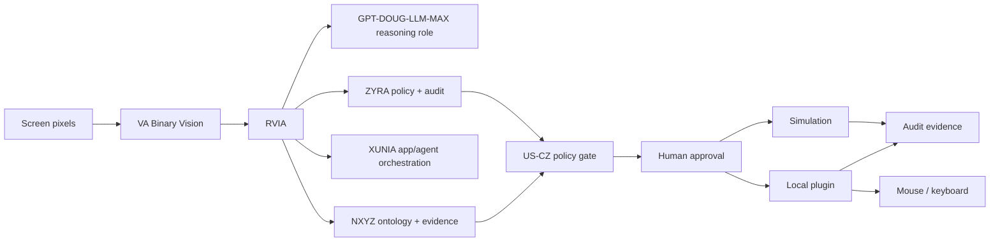
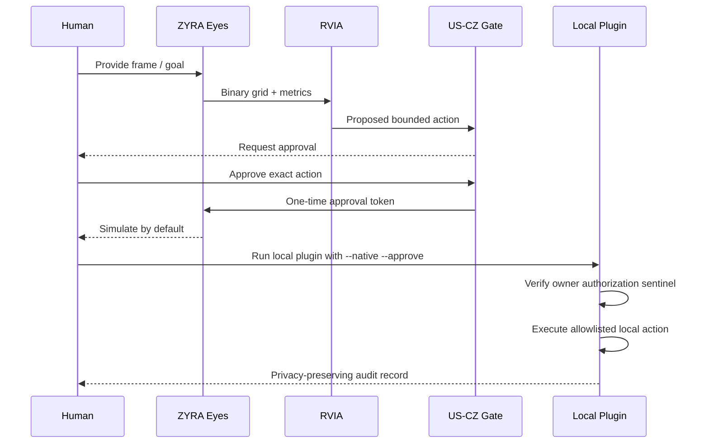

# ZYRA Eyes — VA / RVIA Binary Vision Runtime

**Project:** ZYRA Eyes / Daredevil Binary Runtime  
**Status:** Simulation implemented; local native adapter implemented and disabled by default  
**Language:** `VA` = Virginia runtime language  
**Runtime:** `RVIA` = GPT-DOUG-LLM-MAX + ZYRA + XUNIA + NXYZ unified orchestration layer  
**Profile:** `GOD_MODE` = maximum owner-authorized capability profile, still bounded by US-CZ policy, explicit authorization, platform controls, and human approval.

> The name `GOD_MODE` is an internal capability-profile label. It does not mean unrestricted access and never overrides law, ownership, authorization, authentication, platform protections, or the US-CZ ethical scope.

## Beginner version

Imagine a computer screen as a wall of tiny lights. ZYRA Eyes compresses those lights into a simple field of `0` and `1` values.

- `0` = darker than the threshold
- `1` = brighter than the threshold

That grid becomes a tiny sensory language that RVIA can reason over.

```text
SCREEN / CAMERA-LIKE FRAME
          ↓
      grayscale pixels
          ↓
      VA BINARY GRID
   0011000011110010
   0011000111110010
   0000001111000000
          ↓
    RVIA PERCEPTION
          ↓
  target + confidence + rationale
          ↓
      US-CZ POLICY
          ↓
     HUMAN APPROVAL
          ↓
 SIMULATION or LOCAL ACTION
          ↓
   HASHED AUDIT EVIDENCE
```

## Ecosystem map



## What each part does

| Layer | Beginner meaning | Technical role |
|---|---|---|
| **VA** | Turns what the computer "sees" into simple symbols | Thresholded binary sensory grid and compact runtime language |
| **RVIA** | The conductor | Unified orchestration boundary across GPT-DOUG-LLM-MAX, ZYRA, XUNIA and NXYZ |
| **GPT-DOUG-LLM-MAX role** | Thinks about the observation and goal | Reasoning/planning consumer; does not itself grant device authority |
| **ZYRA** | Decides whether an action is allowed | Policy gate, approval, audit, execution boundary |
| **XUNIA** | Builds/coordinates workflows | Application and agent orchestration |
| **NXYZ** | Keeps meaning and evidence organized | Ontology, provenance, normalization and verification state |
| **Local plugin** | Hands and eyes on the owned machine | Screenshot capture and allowlisted mouse/keyboard actions |
| **US-CZ** | Rulebook | Civilian/private-entity legal and ethical operating scope |

## Runtime profiles

| Profile | Vision | Planning | Mouse/keyboard | Approval | Intended use |
|---|---:|---:|---:|---:|---|
| `OBSERVE` | Yes | No | No | No | Read-only perception experiments |
| `SIMULATE` | Yes | Yes | No | For simulated actions | Default development and demos |
| `OWNER_CONTROLLED` | Yes | Yes | Yes, local only | Every native invocation | Owned-machine accessibility and automation |
| `GOD_MODE` | Yes | Yes | Maximum configured local capability | Mandatory for consequential/native actions | Internal name for owner-supervised maximum capability; never a bypass mode |

## Binary vision example

Input grayscale frame:

|  | 0 | 1 | 2 | 3 |
|---|---:|---:|---:|---:|
| row 0 | 0 | 70 | 180 | 255 |
| row 1 | 230 | 150 | 40 | 0 |

At threshold `128`:

```text
0011
1100
```

The engine also computes:

| Signal | Meaning |
|---|---|
| `density` | Fraction of cells that are `1` |
| `transitions` | Edge-like changes between neighboring 0/1 cells |
| `centroid` | Center of active `1` cells |
| `brightest` | Highest-value source cell |
| `darkest` | Lowest-value source cell |
| `frameHash` | SHA-256 identifier for the sampled frame values |

## Action flow



## Implemented components

| Path | Purpose |
|---|---|
| `server/zyra-eyes.ts` | Binary vision engine, planner, approval tokens, API routes and audit metadata |
| `server/zyra-eyes.test.ts` | Unit tests for binary encoding, planning, approval binding and privacy controls |
| `apps/zyra-eyes-plugin/zyra_eyes.py` | Local screenshot + mouse/keyboard adapter |
| `apps/zyra-eyes-plugin/requirements.txt` | Local plugin dependencies |
| `client/src/pages/zyra-eyes.tsx` | Beginner-facing simulation console |
| `shared/ontology/rvia-vision-control.yaml` | Machine-readable ecosystem/control ontology |
| `.github/workflows/zyra-eyes-ci.yml` | Dedicated project quality gate |
| `docs/logs/ZYRA-EYES-BUILD-LOG.md` | Build and change ledger |

## API

All API routes require an authenticated ZYRA session.

| Endpoint | Behavior |
|---|---|
| `GET /api/zyra-eyes/status` | Returns policy, architecture and whether local native mode is enabled |
| `POST /api/zyra-eyes/analyze` | Converts grayscale pixels into binary vision and metrics |
| `POST /api/zyra-eyes/plan` | Produces a bounded `MOVE` or `LEFT_CLICK` plan |
| `POST /api/zyra-eyes/approve` | Issues a one-time, user-bound approval token for an exact action |
| `POST /api/zyra-eyes/execute` | Simulates the approved action; native actions are delegated to the local plugin |

## Local plugin

Install:

```bash
python3 -m pip install -r apps/zyra-eyes-plugin/requirements.txt
```

Safe simulation:

```bash
python3 apps/zyra-eyes-plugin/zyra_eyes.py --capture --goal brightest
```

Native owner-controlled pointer movement:

```bash
export ZYRA_EYES_NATIVE_CONTROL=I_OWN_AND_AUTHORIZE_THIS_MACHINE
python3 apps/zyra-eyes-plugin/zyra_eyes.py --capture --goal brightest --native --approve
```

PyAutoGUI's failsafe remains enabled. Moving the pointer to the failsafe corner can abort native automation.

## Security model

The project is intentionally not a remote-control implant, stealth agent, credential extractor, surveillance tool, or authorization bypass.

- Native execution is disabled by default.
- The server does not directly control the OS.
- Local execution requires an explicit environment sentinel and `--approve` on each invocation.
- PyAutoGUI failsafe remains enabled.
- Raw screenshots are not written to the audit ledger.
- Typed text is represented in logs only by length and SHA-256 hash.
- No password, cookie, token or credential extraction is implemented.
- Third-party systems still require their own authorization.
- Government/regulated use remains `US_CZ_CONTROLLED` unless separately authorized and configured.

## Reference inspiration

LightOrigins / LightNav-0 was used only as conceptual inspiration for the general perception → spatial reasoning → action architecture. ZYRA Eyes does not claim affiliation, endorsement, shared code, model weights, or robotics compatibility with LightOrigins.
