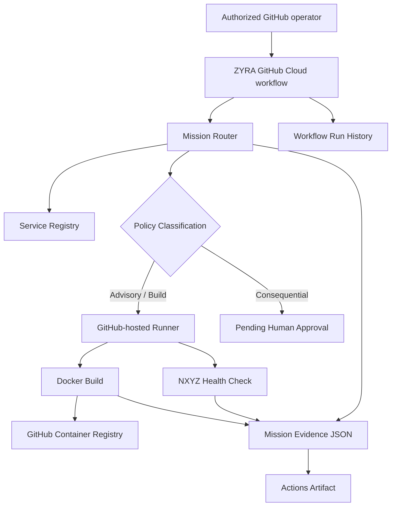

# ZYRA GitHub Cloud

Status: implemented in-repository.

ZYRA GitHub Cloud uses GitHub itself as a cloud-style control surface for the ZYRA/NXYZ ecosystem. It does not pretend GitHub is a full replacement for GCP, AWS, or Azure. Instead, it maps the cloud primitives GitHub actually provides into a governed execution plane that works immediately from this repository.

## Cloud primitive mapping

| Cloud concept | ZYRA GitHub Cloud |
| --- | --- |
| Control plane | Git repository + workflows |
| Compute | GitHub-hosted Actions runners |
| Service registry | `cloud/github/registry.json` |
| Artifact/container registry | GitHub Container Registry (GHCR) |
| Job queue / orchestration | `workflow_dispatch` runs |
| Evidence store | GitHub Actions artifacts |
| Audit log | immutable commits + workflow run history |
| IAM | GitHub repository permissions + `GITHUB_TOKEN` |
| Policy gate | deterministic mission router + blocked consequential actions |
| Release identity | Git commit SHA |

## Architecture



## Files

```text
cloud/github/registry.json
scripts/github-cloud/mission-router.mjs
scripts/github-cloud/validate-registry.mjs
.github/workflows/zyra-github-cloud.yml
.github/workflows/nxyz-ghcr-publish.yml
docs/ZYRA-GITHUB-CLOUD.md
```

## What works now

### Mission routing

From **Actions -> ZYRA GitHub Cloud -> Run workflow**, enter a mission and choose a target/action. The workflow produces a stable mission evidence envelope containing:

- mission ID
- repository, ref, and commit SHA
- inferred mission door
- selected service target
- service capabilities
- risk class
- approval requirement
- execution status

The router defaults to advisory behavior. A request containing consequential verbs such as deploy, publish, submit, send, delete, destroy, purchase, pay, transfer, or approve is classified as consequential and marked `PENDING_HUMAN_APPROVAL`.

### Compute

Safe jobs execute on GitHub-hosted runners. Current job types are:

- `route`: mission routing only
- `registry_snapshot`: preserve the current service registry in the evidence bundle
- `health`: install and boot the NXYZ control plane and verify `/healthz`
- `build`: build the NXYZ container image

### Container registry

`NXYZ GHCR Publish` automatically builds and publishes the NXYZ control-plane image when its implementation or registry changes on `main`.

Published names:

```text
ghcr.io/sonoxo/zyra-nxyz-control:<commit-sha>
ghcr.io/sonoxo/zyra-nxyz-control:main
```

The immutable SHA tag is the release identity. The `main` tag tracks the newest successful main-branch build.

### Evidence and audit

Every manual ZYRA GitHub Cloud mission uploads `.zyra-cloud/` as an Actions artifact for 30 days. The workflow summary records route, target, risk class, approval requirement, action, and commit.

Git commits and GitHub Actions run history provide the control-plane audit trail.

## Service registry

The initial cloud registry includes:

- NXYZ Control Plane
- ZYRA Core
- XUNIA
- GPT-Doug
- NXYZ Horizons Evidence Gateway

The registry is versioned in Git, so changes to service identity and capabilities have commit history and reviewable diffs.

## Relationship to GCP

The existing `services/nxyz-gcp` implementation remains the managed-cloud deployment unit for Cloud Run/Firestore/Secret Manager. GitHub Cloud sits one layer earlier and can operate without a configured Google Cloud account:

```text
Mission Home
   -> ZYRA GitHub Cloud
      -> route / validate / build / evidence
      -> GHCR image
      -> optional future target adapter
           -> GCP
           -> AWS
           -> Azure
           -> self-hosted runtime
```

This makes GitHub the source-of-truth control plane and package factory while keeping provider deployment adapters separate.

## Security invariants

- Workflow input is passed through environment variables instead of interpolated into shell commands.
- Default missions have no external side effects.
- Consequential missions are classified as requiring human approval.
- `GOD_MODE` never bypasses policy.
- GHCR publishing uses the short-lived repository `GITHUB_TOKEN`; no permanent container-registry password is stored in the repo.
- Container releases are tagged by commit SHA.
