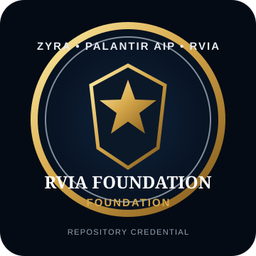
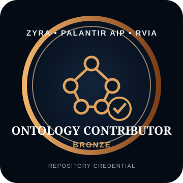
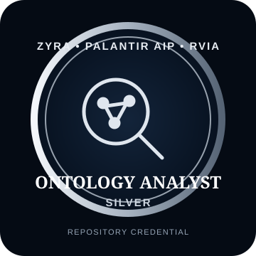
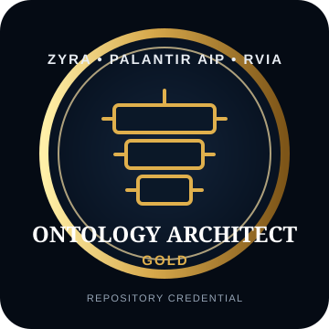
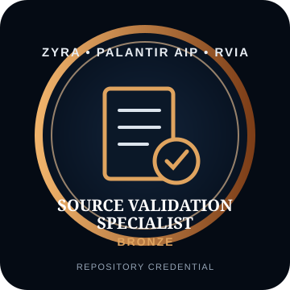
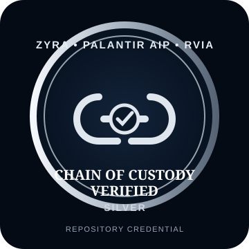
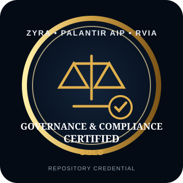
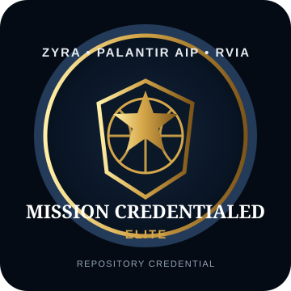
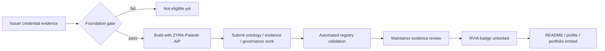

# ZYRA-Palantir AIP RVIA Repository Credentials

> **Program scope:** repository-backed credentials for ontology, provenance, governance, auditability, and AIP/Foundry implementation work in ZYRA.
>
> **Important:** these are ZYRA repository credentials. They are **not** government licenses, security clearances, legal certifications, or credentials issued by Palantir Technologies. "Palantir" identifies the technology track used by this project.

## Credential owner — earned badge set

**Credential owner:** Douglas Brown (`@sonoxo`)  
**Status:** Founding Maintainer  
**Foundation gate:** **PASSED**  
**RVIA repository badges earned:** **8 / 8**

<p align="center">
  
  
  
  
</p>
<p align="center">
  
  
  
  
</p>

### Foundation evidence used for owner issuance

The public credential ledger already records the four required foundational Palantir Learn / Skilljar credentials:

| Foundation credential | Evidence |
|---|---|
| Palantir Foundry Aware | https://verify.skilljar.com/c/iyatkacnyv87 |
| Deep Dive: Data Protection Tools in Foundry | https://verify.skilljar.com/c/gdirvobazx2y |
| Introduction to Foundry & AIP for Enterprise Organizations | https://verify.skilljar.com/c/7ogvo4qo4aad |
| Speedrun: Data Science Fundamentals | https://verify.skilljar.com/c/tt9ue6hsm96y |

Additional Palantir learning completion evidence is recorded for:

- Deep Dive: Creating Your First Ontology
- Deep Dive: Building Your First Pipeline
- Speedrun: Your First End-to-End Workflow

Repository evidence supporting the higher RVIA milestones includes the first ontology milestone, the Palantir AIP community ontology/type contracts, provenance-aware regulatory ontology work, the credential evidence ledger, authorization rules, security rules, and audit/provenance documentation.

## Foundation gate for every user

A user may not unlock an RVIA badge until the **foundation gate** passes.

The default gate requires verified evidence for **all four** foundational credentials below, or a maintainer-approved issuer credential that demonstrably supersedes the same learning area:

1. **Palantir Foundry Aware**
2. **Deep Dive: Data Protection Tools in Foundry**
3. **Introduction to Foundry & AIP for Enterprise Organizations**
4. **Speedrun: Data Science Fundamentals**

A registration email, course enrollment, screenshot without issuer evidence, self-attestation, or repository activity alone does not satisfy the certification gate.

## Badge progression

| Badge | Tier | Unlock requirement after foundation gate |
|---|---|---|
| **RVIA Foundation** | Foundation | Foundation credentials verified + program orientation complete |
| **Ontology Contributor** | Bronze | Merged ontology contribution with supporting evidence |
| **Ontology Analyst** | Silver | Contributor + relationship analysis + provenance + review evidence |
| **Ontology Architect** | Gold | Analyst + versioned ontology/schema design + classes/relations/actions documented + review |
| **Source Validation Specialist** | Bronze | Source provenance + evidence references + validation notes |
| **Chain of Custody Verified** | Silver | Source Validation + immutable references/hashes + lineage + audit trail |
| **Governance & Compliance Certified** | Gold | Ontology Architect + Chain of Custody + governance policy + authorization/security rules |
| **Mission Credentialed** | Elite | All prior badges + maintainer approval + public evidence bundle |

## How users unlock badges while building with ZYRA-Palantir AIP



Applicants add a machine-readable application under:

```text
docs/credentials/applications/<github-handle>.json
```

Use [`rvia-application-template.json`](rvia-application-template.json) as the starting point. The GitHub workflow validates the manifest against [`rvia-badge-registry.json`](rvia-badge-registry.json). Final issuance remains maintainer-reviewed because third-party credential links and qualitative evidence cannot be safely auto-certified from filenames alone.

## Badge portability

Each badge asset is a standalone SVG under `docs/assets/rvia-badges/`. Once a badge is issued, a user may embed it in a README or profile, for example:

```html
<a href="https://github.com/sonoxo/zyra/blob/main/docs/credentials/RVIA-BADGES.md">
  
</a>
```

The verification target should point to the repository credential record or a future public verification endpoint, not merely to the image file.

## Issuance integrity rules

- No badge is issued from self-attestation alone.
- External foundational credentials require issuer-verifiable evidence or an explicitly reviewed equivalent.
- Repository evidence must be traceable to commits, pull requests, versioned ontology files, audit artifacts, or equivalent immutable references.
- `Mission Credentialed` requires every lower badge plus maintainer approval.
- Badges may be revoked or marked historical if supporting evidence is withdrawn, invalidated, or materially misrepresented.
- RVIA badges do not imply employment, government authority, access to restricted systems, Palantir endorsement, or legal licensure.

## Machine-readable authority

The canonical unlock rules and owner issuance are stored in:

- [`rvia-badge-registry.json`](rvia-badge-registry.json)
- [`rvia-application-template.json`](rvia-application-template.json)
- `scripts/rvia-badge-gate.mjs`
- `.github/workflows/rvia-badge-gate.yml`

The visual badge is presentation. The evidence record and registry are the credential authority.
