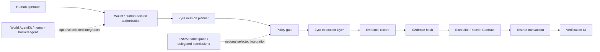

# Planned ETHOnline Architecture

> Planning document only. Substantive integration code is intentionally deferred until the official hacking period.

## Core design



## Trust model

The intended architecture separates execution data from public verification material:

- Mission payloads, API credentials, sensitive evidence and external-service tokens remain offchain.
- Zyra computes deterministic hashes for the mission/evidence objects selected for verification.
- The contract stores only the minimum receipt metadata needed to prove that a specific wallet/agent committed a specific evidence hash at a specific time/status.
- Authorization is checked before governed actions execute.
- The UI links the Zyra result to the corresponding onchain receipt and exposes a verification path.

## Planned receipt shape

Conceptual fields, subject to implementation during the event:

```text
receiptId
operator / agent identity
missionHash
evidenceHash
status
timestamp
network
transactionHash
```

## Security requirements

- Never place Foundry tokens, private keys, session secrets or raw sensitive mission content onchain.
- Wallet signatures must be domain-separated and replay-resistant.
- Contract writes must be attributable to the expected signer/agent authorization path.
- Receipt verification must fail closed on chain/network mismatch or hash mismatch.
- Testnet keys must be treated as secrets even when they have no production funds.

## Demo acceptance criteria

The final demo should prove, end to end:

1. A human-backed operator establishes identity/authorization.
2. Zyra accepts and plans a supported mission.
3. The governed operation passes the policy gate.
4. Zyra produces an evidence object.
5. The application hashes the evidence.
6. A testnet transaction records the receipt.
7. The UI shows the transaction and receipt state.
8. A fresh verification action recomputes the hash and confirms the onchain record.
