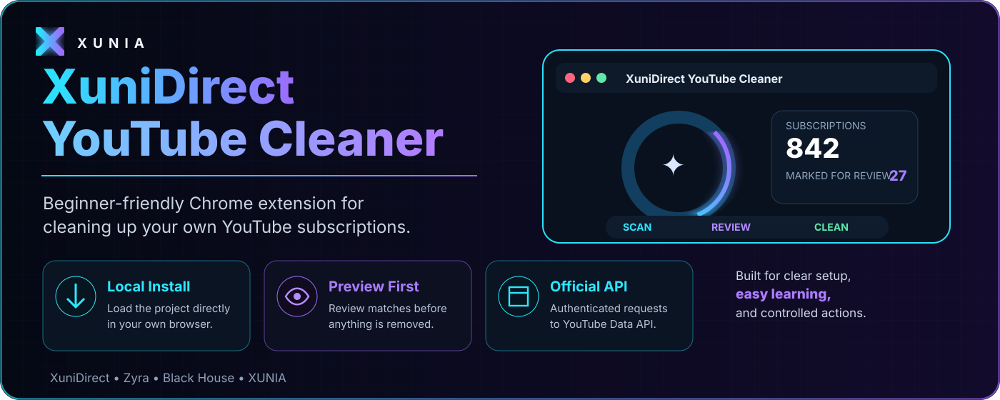
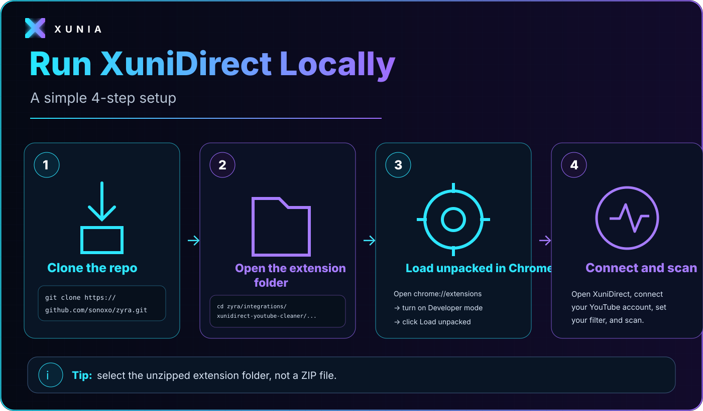
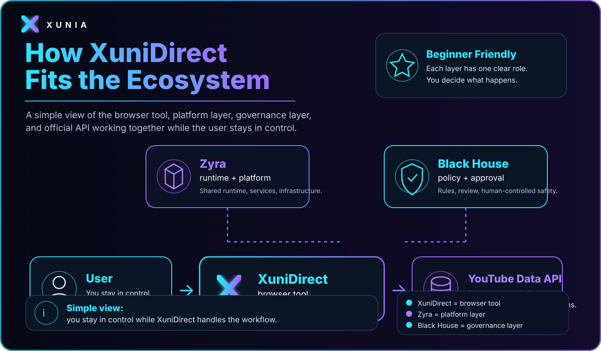

<p align="center">
  
</p>

<h1 align="center">XuniDirect YouTube Cleaner</h1>
<p align="center"><strong>Scan → Filter → Preview → Confirm → Clean</strong></p>
<p align="center">
  <a href="https://sonoxo.github.io/zyra/xunidirect/"><strong>✨ OPEN THE ANIMATED GITHUB PAGES GUIDE</strong></a>
  ·
  <a href="./extension"><strong>VIEW EXTENSION SOURCE</strong></a>
</p>

> **New to Chrome extensions? Start here.** This page is written so you can run XuniDirect without understanding the entire ZYRA codebase first.

## 🟢 What is XuniDirect?

XuniDirect is a Manifest V3 Chrome extension for managing **your own YouTube subscriptions**. It uses the official YouTube Data API instead of trying to click buttons on the YouTube website.

You can:

- scan your authenticated account's subscriptions;
- filter by **before date**, **after date**, or **channel name**;
- preview every match;
- select only the channels you actually want to remove;
- explicitly confirm before unsubscribe requests begin;
- see completion and failure counts.

The simple mental model is:

```text
YOU
 ↓
XUNIDIRECT POPUP
 ↓
CONNECT + SCAN
 ↓
FILTER
 ↓
PREVIEW EXACT MATCHES
 ↓
YOU CONFIRM
 ↓
YOUTUBE DATA API
 ↓
RESULT
```

---

## 🚀 Run XuniDirect locally — beginner path

<p align="center">
  
</p>

### Step 1 — Clone the Git

```bash
git clone https://github.com/sonoxo/zyra.git
```

### Step 2 — Open the extension folder

```bash
cd zyra/integrations/xunidirect-youtube-cleaner/chrome-web-store/extension
open .
```

### Step 3 — Load it in Chrome

1. Open `chrome://extensions`
2. Turn **Developer mode** on.
3. Click **Load unpacked**.
4. Select the actual `extension` folder you opened above.

> ⚠️ **Do not select a ZIP file.** `Load unpacked` expects a folder containing `manifest.json` at its root.

### Step 4 — Connect and scan

Open the XuniDirect toolbar popup, connect your YouTube account, choose your date/name filter, then scan.

The production release still requires the real Google-issued **Chrome Extension OAuth Client ID** bound to the final Store item ID. Never commit an OAuth client secret.

---

## 🧭 How it fits the XUNIA ecosystem

<p align="center">
  
</p>

| Layer | Beginner explanation |
|---|---|
| **User** | You decide what action happens. |
| **XuniDirect** | The Chrome browser tool you interact with. |
| **YouTube Data API** | Supplies subscription data and receives confirmed unsubscribe requests. |
| **Zyra** | Project runtime/platform layer. |
| **Black House** | Project governance, policy, approval, and evidence layer. |

Architecture path:

```text
Toolbar action
   ↓
chrome.identity / Google OAuth
   ↓
YouTube Data API
   ↓
Preview selection
   ↓
Explicit human confirmation
   ↓
subscriptions.delete
   ↓
Result evidence
```

---

## 🧩 Where the files are

```text
chrome-web-store/
├── README.md              ← you are here
├── extension/             ← load this folder in Chrome
└── store-listing/         ← Chrome Web Store submission copy

../../../docs/xunidirect/
├── index.html             ← animated GitHub Pages site
├── styles.css             ← glass UI + motion effects
├── app.js                 ← scroll reveal + parallax + copy buttons
└── assets/                ← Git-native SVG infographics
```

The page is deliberately **self-contained**: no third-party JavaScript library is needed for the visual effects.

---

## 🛍 Chrome Web Store status

| Field | Current state |
|---|---|
| Product | `XuniDirect YouTube Cleaner` |
| Store item ID | `afmhdjmneddlnmfeimikfombdbmjmnjk` |
| Store state | **Draft** |
| Manifest | **V3** |
| OAuth production client | **Google-issued client ID still must be bound** |
| Review approval | **External / Google controlled** |

Do not describe the extension as Chrome Web Store approved until Google actually approves the listing.

---

## 🔐 Safety / privacy boundary

- authenticated owner account only;
- explicit confirmation before destructive unsubscribe execution;
- no browser-history collection;
- no background surveillance;
- no remotely downloaded executable JavaScript;
- no third-party account targeting;
- no embedded OAuth client secret;
- external Google/YouTube names describe interoperability, not endorsement.

## Source-of-truth links

- [Animated XuniDirect GitHub Pages](https://sonoxo.github.io/zyra/xunidirect/)
- [Chrome extension source](./extension)
- [Store listing package](./store-listing)
- [Chrome engineering standard](../../../docs/BLACK_HOUSE_CHROME_EXTENSION_ENGINEERING_STANDARD.md)
- [Black House integration contract](../../../.black-house/integrations/xunidirect-youtube-cleaner.json)

**Take back your feed. Stay in control.**
