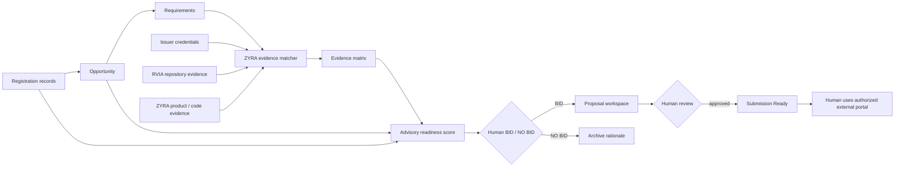
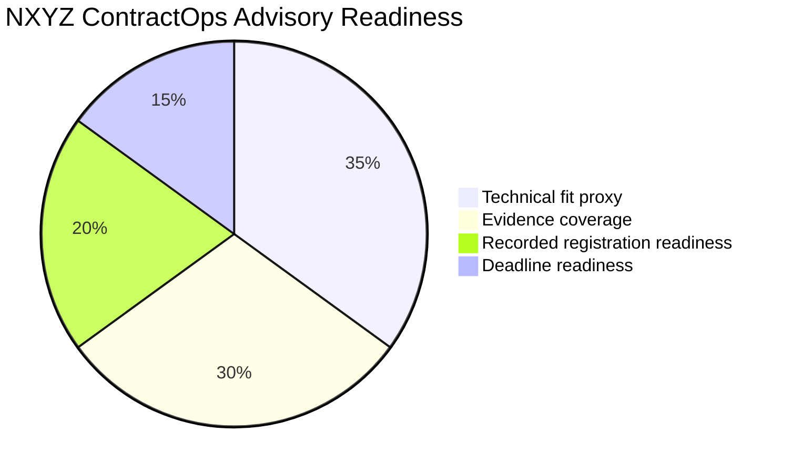
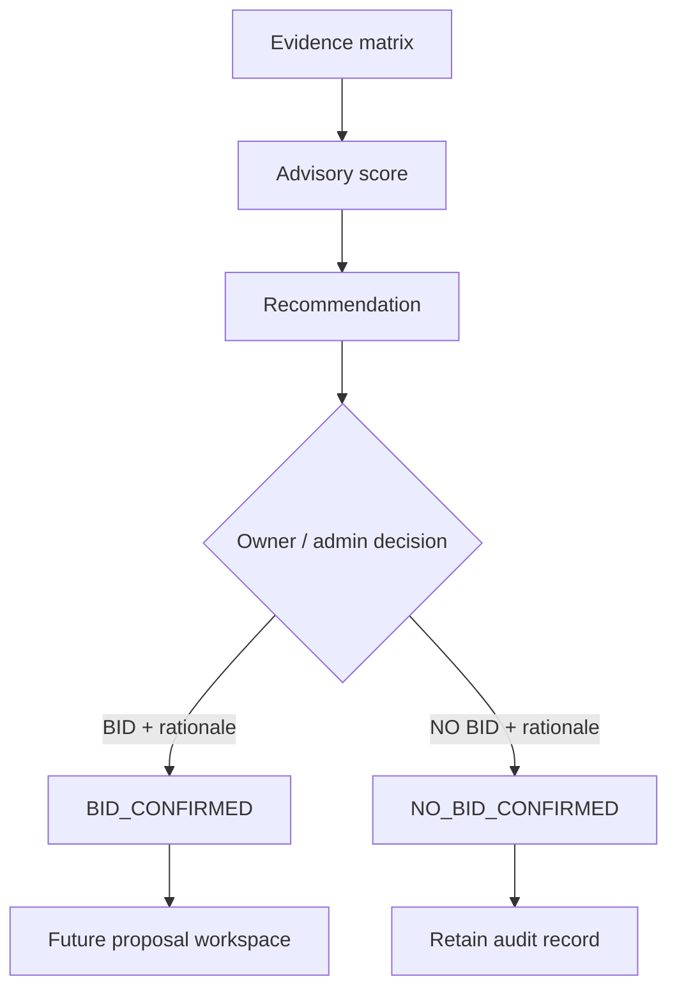

<p align="center">
  
</p>

<h1 align="center">NXYZ ContractOps</h1>
<p align="center"><strong>Federal opportunity readiness for beginners — registrations, requirements, evidence, advisory bid scoring, human decisions, and proposal control inside the ZYRA ecosystem.</strong></p>

<p align="center">
  
  
  
  
</p>

## Start here — what does ContractOps do?

ContractOps is a **federal opportunity mission-control layer** inside ZYRA.

A beginner can think about it like this:

```text
1. RECORD what registrations are actually known
2. CAPTURE a real opportunity from an official source
3. BREAK the opportunity into requirements
4. MATCH requirements to ZYRA evidence
5. SCORE readiness with visible math
6. LET A HUMAN decide BID or NO BID
7. BUILD the proposal from supported claims
8. REVIEW before any external submission
```

The current implementation reaches **step 6**. Proposal workspace is the next product phase.

> **CAGE pending does not stop preparation.** ContractOps keeps CAGE as `PENDING`, includes that state in readiness scoring, and still allows opportunity capture, evidence matching, and advisory analysis. It never invents an identifier.

---

## Current product state

| Capability | State | What it means |
|---|---|---|
| ZYRA navigation entry | **IMPLEMENTED** | `Federal → NXYZ ContractOps` is visible in the main sidebar. |
| `/contractops` dashboard | **IMPLEMENTED** | Protected ZYRA product route. |
| PostgreSQL registration records | **IMPLEMENTED SOURCE** | SAM / UEI / CAGE / SBIR-STTR / DSIP / Grants.gov schema and API exist. Apply with `npm run db:push`. |
| Registration Control UI | **IMPLEMENTED** | Owner/admin can record status, identifier, verification source, and notes. |
| Opportunity intake | **IMPLEMENTED** | Agency, source URL, solicitation, deadline, NAICS, PSC, set-aside, summary, requirements. |
| Evidence matching | **IMPLEMENTED** | Requirements map deterministically to supporting ZYRA credential/repository candidates. |
| Advisory Bid / No-Bid scoring | **IMPLEMENTED** | Four transparent dimensions produce an advisory score and recommendation. |
| Human BID / NO BID decision | **IMPLEMENTED** | Owner/admin records final capture decision with required rationale. |
| Audit trail | **IMPLEMENTED** | Registration, opportunity, evidence, scoring, and human-decision writes emit audit events. |
| Proposal workspace | **NEXT BUILD** | Sections, claim/evidence citations, blockers, reviews, readiness package. |
| Government portal auto-submit | **PROHIBITED** | ContractOps does not silently submit to external government systems. |

---

## Beginner ecosystem map



### What every box means

| Word | Plain-English meaning |
|---|---|
| **Registration** | A recorded status for SAM, UEI, CAGE, SBIR/STTR, DSIP, Grants.gov, etc. |
| **Opportunity** | A real solicitation, SBIR topic, grant, contract, or funding target. |
| **Requirement** | Something the source says the bidder must do, provide, or prove. |
| **Evidence candidate** | A credential, repository artifact, implementation, or other traceable source that may support a requirement. |
| **Evidence gap** | ZYRA does not currently have a matching supporting source for that requirement. |
| **Readiness score** | An internal advisory score; it is not an agency evaluation or eligibility decision. |
| **BID / NO BID** | The human decision about whether to pursue the opportunity. |
| **Submission Ready** | A future ContractOps state after proposal evidence and human review are complete. |

---

## The ZYRA trust layer

ContractOps consumes the existing evidence-tiered ZYRA credential system instead of treating every badge, certificate, repository file, and permission as equivalent.

<p align="center">
  
  
  
  
</p>
<p align="center">
  
  
  
  
</p>

**RVIA badges are ZYRA repository credentials.** They are not government licenses, government credentials, security clearances, or Palantir-issued credentials. Their purpose inside ContractOps is provenance: they help identify repository work that can be inspected as supporting evidence.

The evidence catalog currently includes traceable records in domains such as:

- Palantir Foundry / AIP
- Foundry data protection / governance
- Data science
- Cybersecurity
- Artificial intelligence
- Business intelligence
- Machine learning
- ZYRA ontology / governance repository evidence
- ZYRA software implementation evidence

Every match is labeled:

```text
SUPPORTING_EVIDENCE_ONLY
```

That label matters. A credential match can support a proposal claim; it does **not** create government authorization, clearance, eligibility, contract award, or agency acceptance.

---

## How evidence matching works

ContractOps normalizes each captured requirement and compares its words with a controlled ZYRA evidence catalog.

```text
REQUIREMENT
"Provide AI and machine-learning capability"
       ↓
TOKEN MATCH
AI · machine · learning
       ↓
CANDIDATES
Google AI Professional Certificate
IBM Quantum Machine Learning
Palantir Data Science Fundamentals
       ↓
STATE
SUPPORTED_CANDIDATE
```

If nothing matches:

```text
REQUIREMENT
"Operate a certified deep-sea welding vessel fleet"
       ↓
NO CATALOG SUPPORT
       ↓
STATE
GAP
```

The matcher intentionally reports the gap instead of inventing experience.

---

## Advisory Bid / No-Bid score

The scoring model is transparent and deterministic:



### Dimensions

**Technical fit proxy — 35%**  
Average strength of requirement-to-evidence matches. This is only a proxy for internal qualification.

**Evidence coverage — 30%**  
Percentage of captured requirements with at least one supporting evidence candidate.

**Recorded registration readiness — 20%**  
Uses the SAM, UEI, and CAGE states stored in ContractOps. `ACTIVE` requires a verification source. `PENDING` contributes partial readiness. Missing/unstarted states reduce the score.

**Deadline readiness — 15%**  
Uses the recorded deadline. Past due scores zero; urgent windows are flagged; more lead time increases readiness.

### Advisory recommendation

```text
75–100  → BID_CANDIDATE
50–74   → HUMAN_REVIEW
0–49    → NO_BID_RISK
```

This recommendation **does not change the final BID / NO BID field**. The owner/admin must explicitly record the decision and rationale.

### CAGE pending example

If SAM and UEI are active with traceable verification while CAGE is still pending:

```text
SAM   ACTIVE   = 100
UEI   ACTIVE   = 100
CAGE  PENDING  =  50
-------------------
Recorded registration readiness ≈ 83%
```

So the system can continue qualification work while clearly exposing CAGE as an unresolved registration item.

---

## Human control

ContractOps separates **machine analysis** from **human authority**.



A final human decision:

- requires owner/admin role;
- requires written rationale;
- is written to the ContractOps record;
- emits an audit event;
- does **not** submit anything externally.

---

## API surface

Authenticated ContractOps endpoints currently include:

```text
GET  /api/contractops/registrations
PUT  /api/contractops/registrations/:system

GET  /api/contractops/opportunities
POST /api/contractops/opportunities

GET  /api/contractops/evidence-catalog
POST /api/contractops/opportunities/:id/evidence-match
POST /api/contractops/opportunities/:id/score
PUT  /api/contractops/opportunities/:id/decision

GET  /api/contractops/summary
```

Mutation authorization:

| Operation | Required user state |
|---|---|
| Capture opportunity | Authenticated user |
| Run evidence match | Authenticated user |
| Run advisory score | Authenticated user |
| Update registration | Owner / admin |
| Record final BID / NO BID | Owner / admin + rationale |

---

## Persistence

ContractOps uses organization-scoped PostgreSQL records through Drizzle.

Tables:

```text
contractops_registrations
contractops_opportunities
```

The opportunity record stores:

```text
source metadata
requirements JSON
matching evidence matrix
advisory bid assessment
human bid decision state
```

### Apply the database schema

After pulling this implementation into the runtime environment:

```bash
npm run db:push
```

Until that schema push is applied to the target PostgreSQL database, the source is implemented but the new ContractOps persistence tables are not live in that environment.

---

## Repository map

```text
ZYRA
├── client/src/pages/contractops.tsx
│   └── main ContractOps dashboard
├── client/src/components/contractops/RegistrationControl.tsx
│   └── SAM / UEI / CAGE / program registration controls
├── server/contractops.ts
│   └── authenticated ContractOps API + audit events
├── shared/contractops-schema.ts
│   └── PostgreSQL / Drizzle persistence
├── shared/contractops-evidence.ts
│   └── controlled ZYRA evidence catalog + matching engine
├── shared/contractops-scoring.ts
│   └── deterministic advisory readiness model
├── shared/types/nxyz-contractops.ts
│   └── ecosystem domain contract
├── shared/ontology/nxyz-contractops.yaml
│   └── ontology model, actions, guardrails, implementation state
├── server/contractops-evidence.test.ts
├── server/contractops-scoring.test.ts
├── docs/credentials/
│   └── evidence-tiered credential / RVIA repository credential system
└── products/nxyz-contractops/README.md
    └── this beginner product guide
```

---

## Palantir / AIP mapping

The ContractOps data model is designed to map into an authorized Foundry Ontology:

```text
Organization
  ├── FederalRegistration
  └── Capability
        ├── CredentialEvidence
        └── RepositoryEvidence

Opportunity
  ├── Requirement
  │     └── EvidenceMatch
  ├── BidAssessment
  └── HumanBidDecision

Proposal
  ├── ProposalSection
  └── ReviewDecision
```

The repository contract is **ready for configuration**, but a live Foundry object/action binding must still be created and authorized in the actual tenant before being described as live.

---

## Security / integrity rules

ContractOps enforces these design rules:

- never invent SAM, UEI, CAGE, or other government identifiers;
- `ACTIVE` registration requires a verification source;
- CAGE may remain pending while internal preparation continues;
- credentials do not become authorization;
- evidence matching is supporting evidence only;
- scoring is advisory only;
- final BID / NO BID is human-controlled;
- material proposal claims should resolve to traceable evidence;
- no autonomous government-portal submission;
- no passwords, access tokens, secrets, or restricted data in the ontology contract;
- external permissions remain controlled by the external platform.

---

## Build sequence

**Phase 1 — Foundation ✅**  
Domain types · ontology · beginner dashboard · guardrails · product visual.

**Phase 2 — Persistent opportunity intake ✅**  
Database · registration API · opportunity capture · requirements · sidebar product entry.

**Phase 3 — Evidence qualification ✅**  
Credential/repository evidence catalog · deterministic matching · gaps · regression tests.

**Phase 4A — Bid readiness ✅**  
Four-dimension advisory score · CAGE-pending handling · human BID / NO BID decision · audit trail.

**Phase 4B — Proposal workspace ⏭️**  
Proposal sections · claim-to-evidence citations · blocker resolution · human review · submission-readiness package.

**Phase 5 — Foundry/AIP binding**  
Authorized Ontology object types/actions · AIP extraction/scoring assistance · governed proposal workflow. External government submission remains human-controlled.

---

## Verification language

ContractOps deliberately keeps these states separate:

- **Implemented source** — code exists in GitHub.
- **Database applied** — the target PostgreSQL environment has received the schema.
- **Tested** — automated checks have actually run successfully for that revision.
- **Evidence-backed** — a claim resolves to recorded evidence.
- **Configured** — an external integration has values and permissions.
- **Verified live** — the real external environment completed the operation.
- **Authorized** — the external system granted the required permission.

Never collapse those into a single “verified” claim.

---

<p align="center"><strong>NXYZ ContractOps — capture the opportunity, prove what you can prove, expose what is missing, score transparently, and keep the final decision human.</strong></p>
