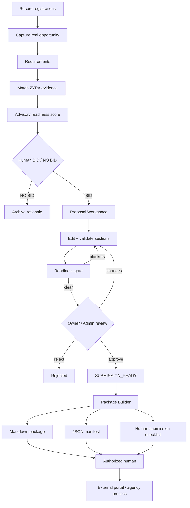
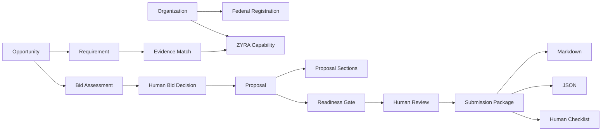

<p align="center">
  
</p>

<h1 align="center">NXYZ ContractOps</h1>
<p align="center"><strong>Federal opportunity readiness for beginners — registrations, evidence, bid qualification, proposal control, internal package export, and human submission inside the ZYRA ecosystem.</strong></p>

<p align="center">
  
  
  
  
  
</p>

## Start here

**ContractOps is a governed capture-to-submission-prep workspace.** A beginner can read the entire system as one chain:

```text
REAL OPPORTUNITY
      ↓
WHAT DOES IT REQUIRE?
      ↓
WHAT CAN ZYRA PROVE?
      ↓
SHOULD WE BID?
      ↓
BUILD + REVIEW THE PROPOSAL
      ↓
EXPORT THE INTERNAL PACKAGE
      ↓
HUMAN SUBMITS THROUGH THE AUTHORIZED EXTERNAL PROCESS
```

ContractOps does **not** claim agency approval, federal eligibility, award status, clearance, or authorization. It organizes evidence and workflow state so a human can make a better documented decision.

---

## v0.7 product state

| Capability | State | What it does |
|---|---|---|
| Registration Control | **IMPLEMENTED** | Tracks SAM, UEI, CAGE, SBIR/STTR, DSIP, and Grants.gov with verification-source rules. |
| Opportunity Intake | **IMPLEMENTED** | Stores official source URL, agency, solicitation metadata, deadline, NAICS/PSC, set-aside, summary, and requirements. |
| Evidence Matching | **IMPLEMENTED** | Maps requirements to ZYRA issuer credentials and repository evidence candidates. |
| Advisory Bid Scoring | **IMPLEMENTED** | Scores technical-fit proxy, evidence coverage, registration readiness, and deadline readiness. |
| Human BID / NO BID | **IMPLEMENTED** | Owner/admin records the final capture decision with written rationale. |
| Proposal Workspace | **IMPLEMENTED** | Creates six database-backed sections after a confirmed human BID. |
| Proposal Readiness Gate | **IMPLEMENTED** | Blocks internal approval while sections, evidence, or configured registration review remain incomplete. |
| Human Proposal Review | **IMPLEMENTED** | Owner/admin can approve, request changes, or reject with notes. |
| `SUBMISSION_READY` | **IMPLEMENTED** | Internal workflow state only. It does not mean agency receipt or acceptance. |
| Submission Package Builder | **IMPLEMENTED** | Builds a reviewed manifest, evidence index, requirement index, registration snapshot, checklist, and proposal sections. |
| Markdown Export | **IMPLEMENTED** | Downloads the internally reviewed package as `.md`. |
| JSON Export | **IMPLEMENTED** | Downloads the machine-readable package manifest as `.json`. |
| Government portal submission | **PROHIBITED FROM AUTOMATION** | An authorized human performs the actual external submission. |

---

## Beginner workflow



The last arrow is intentionally human-controlled.

---

## CAGE pending does not stop the build

ContractOps intentionally keeps the current starter state:

```text
CAGE = PENDING
```

That does **not** prevent:

- opportunity capture
- requirement analysis
- evidence matching
- advisory scoring
- a human BID decision
- proposal drafting
- evidence indexing
- internal package preparation

Under the default internal readiness policy, unresolved CAGE review prevents final `SUBMISSION_READY` until the real issued identifier and verification source are recorded. ContractOps never invents the number.

---

## ZYRA evidence layer

ContractOps uses the existing evidence-tiered ZYRA credential and repository system when an item actually matches a requirement.

<p align="center">
  
  
  
  
  
  
</p>

These are **repository credentials**, not government credentials, security clearances, legal licenses, or Palantir-issued permissions.

Evidence matches carry this authority:

```text
SUPPORTING_EVIDENCE_ONLY
```

That separation matters:

```text
TRAINING / REPOSITORY EVIDENCE
              ↓
CAN SUPPORT A CLAIM
              ≠
GOVERNMENT AUTHORIZATION
```

---

## Advisory Bid / No-Bid model


The engine can recommend:

```text
BID_CANDIDATE
HUMAN_REVIEW
NO_BID_RISK
```

but only a human owner/admin can store:

```text
BID
NO_BID
```

with rationale.

---

## Proposal Workspace

A confirmed `BID` can generate six governed starter sections:

1. **Executive Summary**
2. **Technical Approach**
3. **Requirements & Evidence Matrix**
4. **Credentials & Evidence Plan**
5. **Management & Delivery Plan**
6. **Risks, Assumptions & Open Items**

Generated content is explicitly a **draft framework requiring human validation**. ContractOps does not fabricate past performance, staffing, pricing, facilities, certifications, clearances, eligibility, or agency acceptance.

Each section moves through:

```text
DRAFT
  ↓
EVIDENCE_NEEDED
  ↓
READY
```

The human review gate will not approve the package until the configured blockers are cleared.

---

## Submission Package Builder

Once a proposal is internally:

```text
reviewDecision = APPROVED
status = SUBMISSION_READY
all sections = READY
```

ContractOps can generate:

```text
nxyz-contractops-package/1.0
├── proposal metadata
├── opportunity metadata
├── registration snapshot
├── readiness snapshot
├── evidence index
├── requirement index
├── human submission checklist
└── reviewed proposal sections
```

The package always records:

```json
{
  "externalSubmissionPerformed": false
}
```

### Markdown download

The `.md` export is human-readable and includes the opportunity, registration snapshot, checklist, evidence index, and full proposal sections.

### JSON download

The `.json` export is machine-readable and can later feed authorized ZYRA / NXYZ / Palantir workflows without pretending an external submission occurred.

### Human submission checklist

The package explicitly requires a human to re-check:

- current official solicitation instructions
- required forms, representations, certifications, and signatures
- pricing / budget commitments
- required attachments and formatting
- amendments and deadlines
- the final portal upload and submission action

---

## Internal readiness policy

Default policy:

```text
NXYZ_CONTRACTOPS_DEFAULT_V1
```

It currently checks:

- Human `BID` decision exists.
- No captured requirement has an unresolved evidence gap.
- Every generated proposal section is `READY` with substantive content.
- SAM / UEI / CAGE review is resolved under the default internal policy.
- Owner/admin performs final proposal review.

This is a **workflow policy**, not legal advice and not an agency eligibility determination. Opportunity-specific requirements must still be verified from the official source.

---

## API surface

```text
GET  /api/contractops/registrations
PUT  /api/contractops/registrations/:system

GET  /api/contractops/opportunities
POST /api/contractops/opportunities
POST /api/contractops/opportunities/:id/evidence-match
POST /api/contractops/opportunities/:id/score
PUT  /api/contractops/opportunities/:id/decision

GET  /api/contractops/proposals
GET  /api/contractops/proposals/:id
POST /api/contractops/opportunities/:id/proposal
PUT  /api/contractops/proposals/:id/sections/:sectionId
POST /api/contractops/proposals/:id/refresh-readiness
PUT  /api/contractops/proposals/:id/review
POST /api/contractops/proposals/:id/package
```

Material state changes are organization-scoped, authenticated, role-gated where appropriate, and written into the existing ZYRA audit trail.

---

## Architecture



### Key implementation files

```text
shared/contractops-schema.ts
shared/contractops-evidence.ts
shared/contractops-scoring.ts
shared/contractops-proposal.ts
shared/contractops-package.ts
shared/types/nxyz-contractops.ts
shared/ontology/nxyz-contractops.yaml

server/contractops.ts
server/contractops-proposals.ts
server/contractops-package.ts

client/src/pages/contractops.tsx
client/src/components/contractops/RegistrationControl.tsx
client/src/components/contractops/ProposalWorkspace.tsx
```

Ontology contract: **v0.7.0**

---

## Deployment requirement

ContractOps now defines additional PostgreSQL tables for proposals and sections. A target Zyra environment still needs to apply the schema using its real database connection:

```bash
npm run db:push
```

Repository source and CI success do not by themselves prove a specific deployed database has already been migrated.

---

## Safety / trust boundaries

- Never invent SAM, UEI, CAGE, or another government identifier.
- Never mark a registration `ACTIVE` without a verification source.
- Never treat a training credential as authorization.
- Never treat an RVIA badge as clearance or government authority.
- Never turn an advisory score into an automatic BID decision.
- Never create a proposal before a human BID decision.
- Never approve a proposal while configured readiness blockers remain.
- Never call `SUBMISSION_READY` agency acceptance.
- Never call a package export an external submission.
- Never auto-submit to a government portal.
- Never store portal passwords, bearer tokens, secrets, or restricted data in the ContractOps ontology.

---

## Next build target

**Opportunity Source Ingestion** is the next high-value layer:

```text
OFFICIAL URL / SOLICITATION DOCUMENT
              ↓
SOURCE SNAPSHOT + PROVENANCE
              ↓
METADATA EXTRACTION
              ↓
REQUIREMENT EXTRACTION
              ↓
HUMAN VERIFY
              ↓
CONTRACTOPS OPPORTUNITY
```

That would eliminate most manual opportunity entry while preserving provenance and human verification.

---

<p align="center"><strong>NXYZ ContractOps — find the requirement, prove the capability, make the human decision, export the reviewed package, and keep the actual submission human-controlled.</strong></p>
