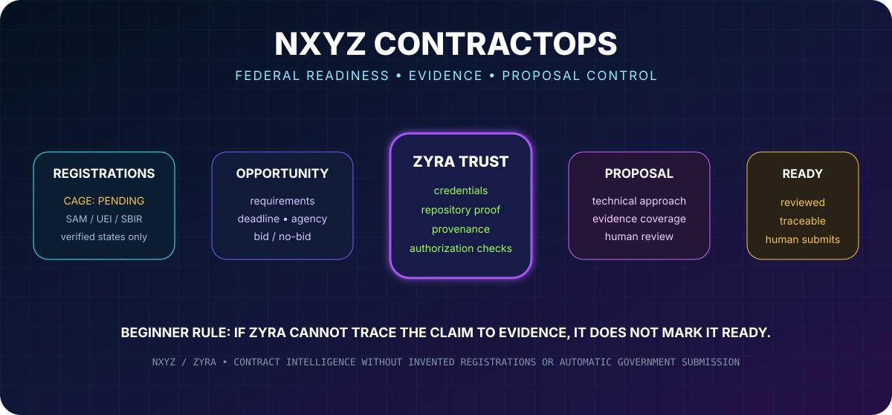
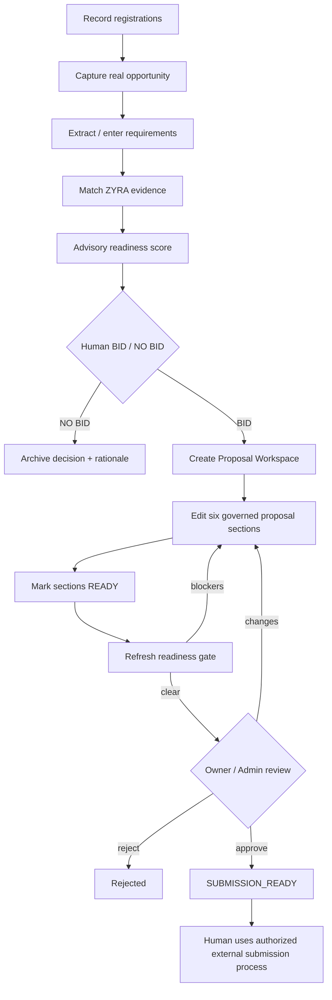
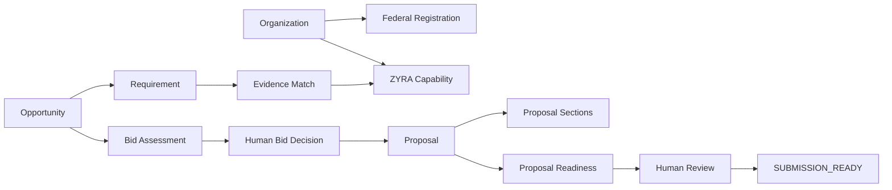

<p align="center">
  
</p>

<h1 align="center">NXYZ ContractOps</h1>
<p align="center"><strong>Federal opportunity readiness for beginners — registrations, evidence, bid qualification, proposal control, and human review inside the ZYRA ecosystem.</strong></p>

<p align="center">
  
  
  
  
</p>

## Start here

**ContractOps is a governed capture-to-proposal workspace.** It helps a beginner answer five questions in order:

```text
WHAT opportunity are we looking at?
        ↓
WHAT does it require?
        ↓
WHAT can ZYRA actually prove?
        ↓
SHOULD a human decide to bid?
        ↓
IS the proposal internally ready for human submission?
```

It does **not** claim that an agency approved the company, that a credential creates federal authorization, or that an internal score equals government eligibility.

---

## v0.6 — what is live now?

| Product capability | State | What it does |
|---|---|---|
| Registration Control | **IMPLEMENTED** | Tracks SAM, UEI, CAGE, SBIR/STTR, DSIP, and Grants.gov states with verification-source rules. |
| Opportunity Intake | **IMPLEMENTED** | Stores real source URL, agency, solicitation number, deadline, NAICS/PSC, set-aside, summary, and requirements. |
| Evidence Matching | **IMPLEMENTED** | Maps captured requirements to ZYRA issuer credentials and repository evidence candidates. |
| Advisory Bid Scoring | **IMPLEMENTED** | Scores technical-fit proxy, evidence coverage, registration readiness, and deadline readiness. |
| Human BID / NO BID | **IMPLEMENTED** | Owner/admin records the final capture decision with written rationale. |
| Proposal Workspace | **IMPLEMENTED** | Creates database-backed proposal sections only after a confirmed human BID decision. |
| Proposal Readiness Gate | **IMPLEMENTED** | Blocks internal approval while sections, evidence, or configured registration review remain incomplete. |
| Human Proposal Review | **IMPLEMENTED** | Owner/admin can approve, request changes, or reject with notes. |
| `SUBMISSION_READY` | **IMPLEMENTED** | Internal workflow state only; no external portal action occurs. |
| Automatic government submission | **PROHIBITED** | ContractOps never silently submits, signs, certifies, or commits pricing to an agency. |

---

## Beginner workflow



### Why this matters

A proposal can sound strong and still be weak if the claims cannot be traced to proof. ContractOps keeps **capability**, **evidence**, **registration state**, **human decisions**, and **external authorization** separate.

---

## Proposal Workspace

After a human records `BID`, ContractOps can create one workspace for that opportunity with six starter sections:

1. **Executive Summary**
2. **Technical Approach**
3. **Requirements & Evidence Matrix**
4. **Credentials & Evidence Plan**
5. **Management & Delivery Plan**
6. **Risks, Assumptions & Open Items**

The generated text is deliberately labeled as a **draft framework requiring human validation**. It does not fabricate past performance, staffing, eligibility, clearances, certifications, pricing, facilities, or agency acceptance.

```text
CONFIRMED HUMAN BID
       ↓
PROPOSAL SEED
       ↓
DRAFT / EVIDENCE_NEEDED / READY
       ↓
READINESS ENGINE
       ↓
BLOCKERS OR CLEAR GATE
       ↓
OWNER / ADMIN REVIEW
       ↓
SUBMISSION_READY
```

`SUBMISSION_READY` means **the configured internal ContractOps gate passed**. It does not mean a government portal received the package or that an agency accepted it.

---

## The readiness gate

The default policy is machine-readable as:

```text
NXYZ_CONTRACTOPS_DEFAULT_V1
```

It currently checks:

- Human `BID` decision exists.
- No captured requirement remains an unresolved evidence gap.
- Every generated proposal section is marked `READY` with substantive content.
- SAM / UEI / CAGE review is resolved under the default internal policy.
- Owner/admin performs final proposal review.

> This is a **workflow policy**, not legal advice and not a statement that every solicitation has identical registration requirements. The specific opportunity must still be checked against its official instructions.

### CAGE is still pending

That state is intentional:

```text
CAGE = PENDING
```

ContractOps allows research, opportunity capture, evidence matching, scoring, BID decisions, and proposal drafting to continue. Under the default internal gate, unresolved CAGE review prevents `SUBMISSION_READY` until the real issued identifier and verification source are recorded.

No identifier is invented.

---

## ZYRA evidence layer

ContractOps can use the existing evidence-tiered ZYRA credential and repository system when the evidence actually matches a requirement.

<p align="center">
  
  
  
  
  
  
</p>

These are **repository credentials**, not government credentials, security clearances, licenses, or Palantir-issued permissions.

Evidence candidates currently span domains such as:

- Palantir Foundry / AIP
- cybersecurity
- artificial intelligence
- data science
- business intelligence
- Linux / systems
- application development
- ZYRA ontology / governance implementation
- repository implementation evidence

A match has authority:

```text
SUPPORTING_EVIDENCE_ONLY
```

That means it can help a human support a proposal claim. It does not independently prove contract eligibility or agency acceptance.

---

## Advisory Bid / No-Bid model


The model produces:

```text
BID_CANDIDATE
HUMAN_REVIEW
NO_BID_RISK
```

Those are recommendations only. The actual stored decision remains:

```text
UNDER_REVIEW → BID
             ↘ NO_BID
```

and requires an owner/admin rationale.

---

## API surface

```text
GET  /api/contractops/registrations
PUT  /api/contractops/registrations/:system

GET  /api/contractops/opportunities
POST /api/contractops/opportunities
POST /api/contractops/opportunities/:id/evidence-match
POST /api/contractops/opportunities/:id/score
PUT  /api/contractops/opportunities/:id/decision

GET  /api/contractops/proposals
GET  /api/contractops/proposals/:id
POST /api/contractops/opportunities/:id/proposal
PUT  /api/contractops/proposals/:id/sections/:sectionId
POST /api/contractops/proposals/:id/refresh-readiness
PUT  /api/contractops/proposals/:id/review
```

All records are organization-scoped through authenticated ZYRA requests. Mutating review decisions use role gates and ContractOps writes audit events for material state changes.

---

## Data architecture



PostgreSQL persistence is defined in:

- [`shared/contractops-schema.ts`](../../shared/contractops-schema.ts)
- [`shared/contractops-proposal.ts`](../../shared/contractops-proposal.ts)
- [`shared/contractops-evidence.ts`](../../shared/contractops-evidence.ts)
- [`shared/contractops-scoring.ts`](../../shared/contractops-scoring.ts)

Server implementation:

- [`server/contractops.ts`](../../server/contractops.ts)
- [`server/contractops-proposals.ts`](../../server/contractops-proposals.ts)

Client implementation:

- [`client/src/pages/contractops.tsx`](../../client/src/pages/contractops.tsx)
- [`client/src/components/contractops/RegistrationControl.tsx`](../../client/src/components/contractops/RegistrationControl.tsx)
- [`client/src/components/contractops/ProposalWorkspace.tsx`](../../client/src/components/contractops/ProposalWorkspace.tsx)

Ontology:

- [`shared/ontology/nxyz-contractops.yaml`](../../shared/ontology/nxyz-contractops.yaml) — **v0.6.0**

---

## Deployment step

The source now defines additional ContractOps proposal tables. The target Zyra PostgreSQL environment must apply the schema:

```bash
npm run db:push
```

That deployment action requires the environment's real `DATABASE_URL`; the repository source alone does not prove the live database has already been migrated.

---

## Guardrails

ContractOps is designed to preserve these boundaries:

- Never invent SAM, UEI, CAGE, or other registration identifiers.
- Never mark a registration `ACTIVE` without a verification source.
- Never treat a training credential as government authorization.
- Never treat a repository badge as a clearance or license.
- Never turn an advisory readiness score into an automatic BID decision.
- Never create a proposal before a human BID decision.
- Never approve a proposal while the configured readiness gate has blockers.
- Never represent `SUBMISSION_READY` as agency acceptance.
- Never auto-submit to government portals.
- Never store portal passwords, bearer tokens, secrets, or restricted data in the ContractOps ontology.

---

## What comes next

The strongest next product layer is **Submission Package Builder**:

```text
APPROVED INTERNAL PROPOSAL
          ↓
PACKAGE MANIFEST
          ↓
SECTION EXPORTS + EVIDENCE INDEX
          ↓
FINAL HUMAN CHECKLIST
          ↓
DOWNLOADABLE / PORTAL-READY PACKAGE
          ↓
HUMAN SUBMISSION
```

That next layer can prepare files and a checklist while still keeping the actual external submission human-controlled.

---

<p align="center"><strong>NXYZ ContractOps — find the requirement, prove the capability, make the human decision, and keep the evidence attached to the work.</strong></p>
