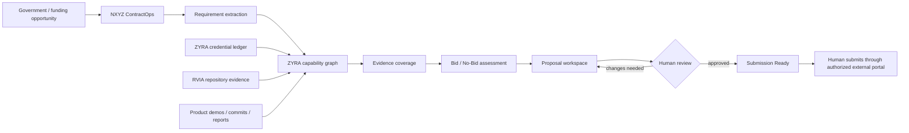
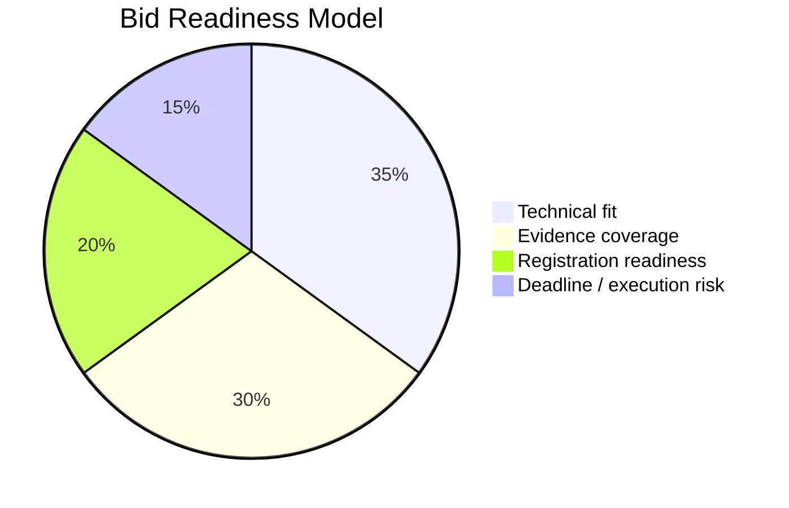

<p align="center">
  
</p>

<h1 align="center">NXYZ ContractOps</h1>
<p align="center"><strong>Federal opportunity readiness for beginners — registrations, requirements, evidence, proposals, and human review in one governed Zyra workflow.</strong></p>

<p align="center">
  
  
  
  
</p>

## What is this?

If federal contracting is new to you, think of ContractOps as a **mission control board for getting a company ready to pursue an opportunity**.

Instead of keeping registrations in one tab, credentials in another folder, solicitation requirements in a PDF, and proposal claims in a document with no proof trail, ContractOps connects them:

```text
REGISTRATION
    ↓
OPPORTUNITY
    ↓
REQUIREMENTS
    ↓
ZYRA CAPABILITIES
    ↓
CREDENTIAL + REPOSITORY EVIDENCE
    ↓
BID / NO-BID SCORE
    ↓
PROPOSAL WORKSPACE
    ↓
HUMAN REVIEW
    ↓
SUBMISSION READY
```

**Important:** `SUBMISSION READY` does not mean Zyra automatically submits anything to a government portal. Final submission remains a human-controlled external action.

## Beginner translation

| ContractOps word | Plain-English meaning |
|---|---|
| **Registration** | A government/vendor registration such as SAM, UEI, CAGE, SBIR/STTR, or DSIP. |
| **Opportunity** | A contract, solicitation, SBIR topic, grant, or other funding target you may pursue. |
| **Requirement** | Something the opportunity says you must provide or prove. |
| **Capability** | Something Zyra / NXYZ / the organization can actually demonstrate. |
| **Evidence** | A credential, repository artifact, verification link, commit, demo, report, or other traceable proof. |
| **Bid assessment** | A structured answer to “Should we spend time pursuing this?” |
| **Proposal** | The response being prepared for the opportunity. |
| **Submission ready** | Required checks passed and a human reviewer approved the package for external submission. |

## The Zyra trust layer

ContractOps does not treat every badge or certificate as the same thing. It consumes the existing **ZYRA evidence-tiered credential system** and keeps training evidence separate from authorization.

<p align="center">
  
  
  
  
</p>
<p align="center">
  
  
  
  
</p>

Those badges are **ZYRA repository credentials** backed by the repository's evidence and review rules. They are not government credentials, security clearances, legal licenses, or credentials issued by Palantir. See [`RVIA-BADGES.md`](../../docs/credentials/RVIA-BADGES.md).

### Foundation credential evidence available to the ecosystem

The ZYRA credential ledger records issuer/supplied evidence across Palantir Foundry/AIP, cybersecurity, AI, business intelligence, data science, Linux/system administration, application development, and other learning domains. ContractOps may use that evidence to support a capability claim **only when the claim actually matches the evidence**.

For example:

```text
Opportunity requirement:
"Demonstrate experience with data governance and platform security"

              ↓ match

ZYRA capability:
"Governed ontology / provenance implementation"

              ↓ evidence

Issuer credential evidence + repository ontology work + audit/provenance artifacts

              ↓

Requirement coverage = SUPPORTED
```

It must **not** do this:

```text
Training badge → pretend federal authorization exists
```

The credential ledger explicitly keeps those evidence classes separate.

## How the ecosystem works



### Palantir / AIP path

The domain contract is designed to map cleanly into a Foundry Ontology later:

```text
Organization
  ├─ hasRegistration → FederalRegistration
  └─ hasCapability → Capability
                         ├─ supportedByCredential → CredentialEvidence
                         └─ supportedByRepositoryEvidence → RepositoryEvidence

Opportunity
  ├─ hasRequirement → Requirement
  │                      └─ matchedBy → Capability
  └─ hasAssessment → BidAssessment

Proposal
  ├─ forOpportunity → Opportunity
  ├─ hasSection → ProposalSection
  └─ hasReview → ReviewDecision
```

Machine-readable ontology: [`shared/ontology/nxyz-contractops.yaml`](../../shared/ontology/nxyz-contractops.yaml)

TypeScript contracts: [`shared/types/nxyz-contractops.ts`](../../shared/types/nxyz-contractops.ts)

## Starter readiness state

The first UI intentionally starts conservatively:

| Item | Starter state | Why |
|---|---|---|
| **CAGE** | `PENDING` | No identifier is stored until it is actually issued and verified. |
| Other registrations | `VERIFY / NOT RECORDED` | ContractOps does not infer status from unrelated evidence. |
| Opportunities | `0` until captured | No fake opportunity inventory. |
| Proposal submissions | Human-controlled | Zyra may prepare and validate; it does not silently submit to government systems. |

## What ContractOps scores

A future live opportunity score is composed from four independent dimensions:



The weights can be made configurable later. The important design rule is that **technical fit and proof coverage are separate**: being capable is not the same thing as having enough evidence for a proposal claim.

## Product controls

ContractOps is built around these guardrails:

- Never invent SAM, UEI, CAGE, or other government registration identifiers.
- Never promote a registration to `ACTIVE` without a verification source.
- Never turn a training credential into an authorization claim.
- Require evidence for material proposal claims.
- Keep provenance for evidence and opportunity sources.
- Require human review before `SUBMISSION_READY`.
- Never auto-submit to government portals.
- Never commit portal passwords, tokens, secrets, or restricted data.

## Repository map

```text
ZYRA
├── client/src/pages/contractops.tsx
│   └── beginner federal-readiness dashboard
├── shared/types/nxyz-contractops.ts
│   └── TypeScript domain contract
├── shared/ontology/nxyz-contractops.yaml
│   └── ontology classes, relations, actions and guardrails
├── docs/assets/nxyz-contractops-hero.svg
│   └── ecosystem product graphic
├── docs/credentials/
│   └── evidence-tiered credential + RVIA repository credential system
└── products/nxyz-contractops/README.md
    └── this beginner product guide
```

## Build sequence

**Phase 1 — foundation (this commit)**

- Domain types
- Ontology contract
- Beginner dashboard
- Registration/evidence guardrails
- Product README and ecosystem visualization

**Phase 2 — opportunity intake**

- Import solicitation metadata and source URL
- Requirement extraction
- Deadline tracking
- NAICS / PSC / set-aside fields

**Phase 3 — evidence matching**

- Map requirements to ZYRA capabilities
- Resolve credential and repository evidence
- Show unsupported claims and blockers

**Phase 4 — proposal workspace**

- Capability statement generation
- Technical approach sections
- Evidence citations
- Human review workflow

**Phase 5 — Foundry/AIP implementation**

- Create the ContractOps object types in the authorized Ontology
- Bind AIP Logic for extraction / scoring / drafting
- Keep final external submission outside autonomous AIP actions

## Verification language

This repository distinguishes:

- **Implemented** — source exists in the repository.
- **Evidence-backed** — a claim resolves to a recorded evidence source.
- **Configured** — external integration values and permissions are present.
- **Verified live** — a real external environment completed the expected operation.
- **Authorized** — the relevant external system granted the required permission.

Do not collapse these states into one “verified” label.

---

<p align="center"><strong>NXYZ ContractOps — find the requirement, prove the capability, review the package, then submit with a human in command.</strong></p>
