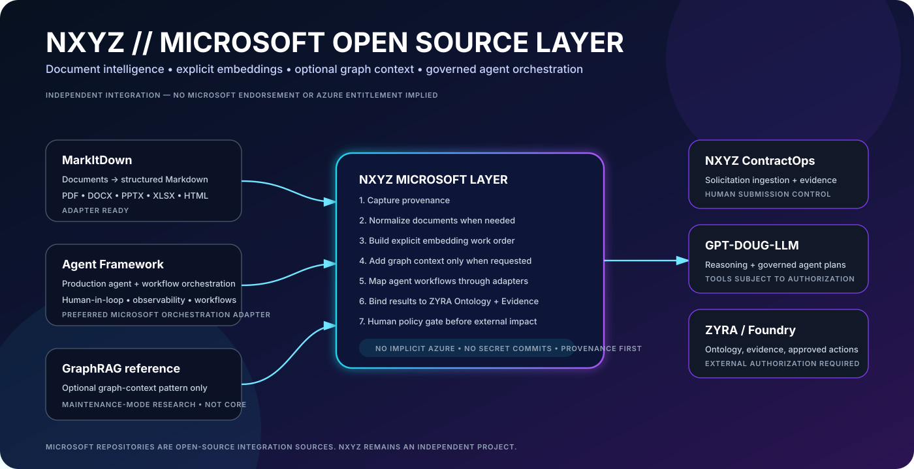

<p align="center">
  
</p>

<h1 align="center">NXYZ Microsoft Open Source Layer</h1>
<p align="center"><strong>Optional Microsoft OSS document, embedding, retrieval, and agent orchestration layer for the ZYRA ecosystem.</strong></p>

<p align="center">
  
  
  
  
</p>

## What it does

```text
MICROSOFT OPEN SOURCE
        ↓
MarkItDown → document normalization
Agent Framework → agent/workflow orchestration adapter
GraphRAG → optional graph-context reference
        ↓
NXYZ MICROSOFT LAYER
        ↓
ZYRA ONTOLOGY + EVIDENCE
        ↓
CONTRACTOPS / GPT-DOUG-LLM / OPTIONAL FOUNDRY
        ↓
HUMAN POLICY GATE
```

This is an **independent NXYZ integration layer**. It does not imply Microsoft sponsorship, endorsement, Azure entitlement, tenant access, or authorization.

## Upstream sources

| Microsoft repository | NXYZ role | Upstream posture |
|---|---|---|
| [`microsoft/agent-framework`](https://github.com/microsoft/agent-framework) | Preferred agent orchestration adapter | Production-ready upstream |
| [`microsoft/markitdown`](https://github.com/microsoft/markitdown) | Document normalization adapter | Active upstream |
| [`microsoft/graphrag`](https://github.com/microsoft/graphrag) | Optional graph/retrieval reference | Maintenance-mode research upstream |

## Beginner meaning

If you give ZYRA a solicitation, technical manual, Word document, spreadsheet, or other supported source, the Microsoft layer is designed to help turn it into structured context that NXYZ can reason over.

```text
FILE
 ↓
NORMALIZED TEXT
 ↓
PROVENANCE
 ↓
EMBEDDING WORK ORDER
 ↓
OPTIONAL GRAPH CONTEXT
 ↓
AGENT WORKFLOW
 ↓
ZYRA EVIDENCE
```

No paid service is forced by the architecture. Embedding providers are explicit:

`LOCAL` · `AZURE_OPENAI` · `OPENAI_COMPATIBLE` · `CUSTOM`

If none is selected, the plan reports a blocker instead of pretending indexing occurred.

## API

```text
GET  /api/nxyz/microsoft-layer/status
POST /api/nxyz/microsoft-layer/plan
```

Example:

```json
{
  "inputKind": "CONTRACT_OPPORTUNITY",
  "needsGraphContext": true,
  "needsAgents": true,
  "embeddingProvider": "LOCAL"
}
```

Current mode:

```text
PLAN_ONLY_ADAPTER_READY
```

That means the NXYZ policy/orchestration contract is implemented and testable, while actual Microsoft runtime package adapters remain explicit follow-on integrations.

## Why GraphRAG is optional

Microsoft's GraphRAG repository currently describes itself as a research project in maintenance mode. NXYZ therefore uses it only as an optional reference pattern rather than making it part of the platform's required runtime.

## ContractOps binding

The high-value first consumer is **NXYZ ContractOps**:

```text
OFFICIAL SOLICITATION
 ↓
MarkItDown adapter
 ↓
SOURCE SNAPSHOT + HASH
 ↓
REQUIREMENTS
 ↓
OPTIONAL EMBEDDING / GRAPH CONTEXT
 ↓
Agent Framework adapter
 ↓
CONTRACTOPS EVIDENCE + HUMAN REVIEW
```

This directly supports the next ContractOps target: automated Opportunity Source Ingestion with provenance and human verification.

## Files

```text
shared/nxyz-microsoft-layer.ts
shared/ontology/nxyz-microsoft-oss-layer.yaml
server/nxyz-microsoft-layer.ts
server/nxyz-microsoft-layer.test.ts
docs/NXYZ-MICROSOFT-OSS-LAYER.md
docs/assets/nxyz-microsoft-layer.svg
```

Full technical guide: [`docs/NXYZ-MICROSOFT-OSS-LAYER.md`](../../docs/NXYZ-MICROSOFT-OSS-LAYER.md)

<p align="center"><strong>Microsoft OSS provides optional building blocks. NXYZ keeps the policy, provenance, authorization, and evidence boundaries.</strong></p>
